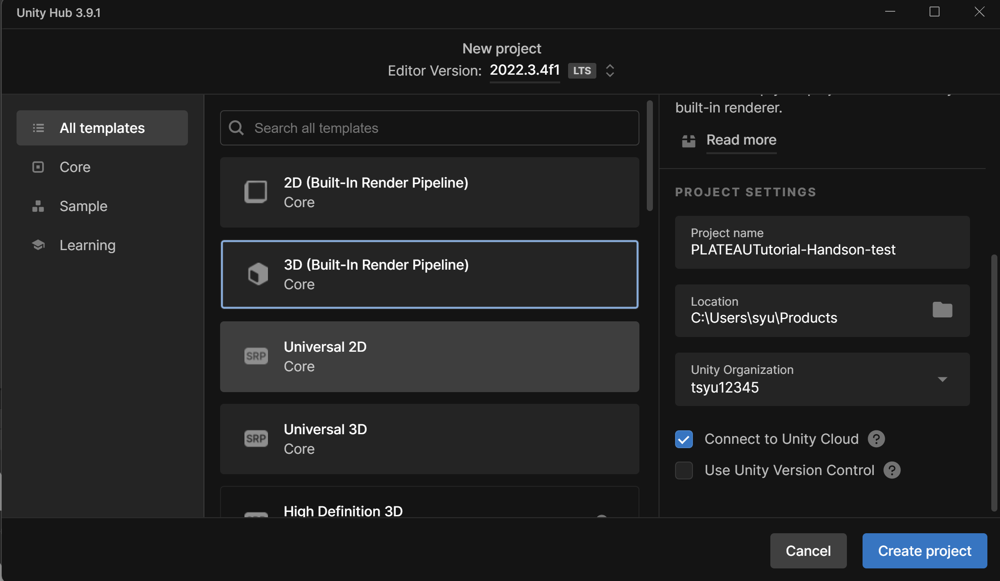
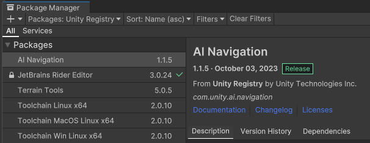
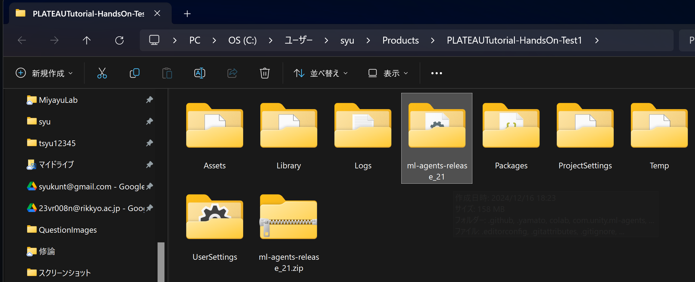
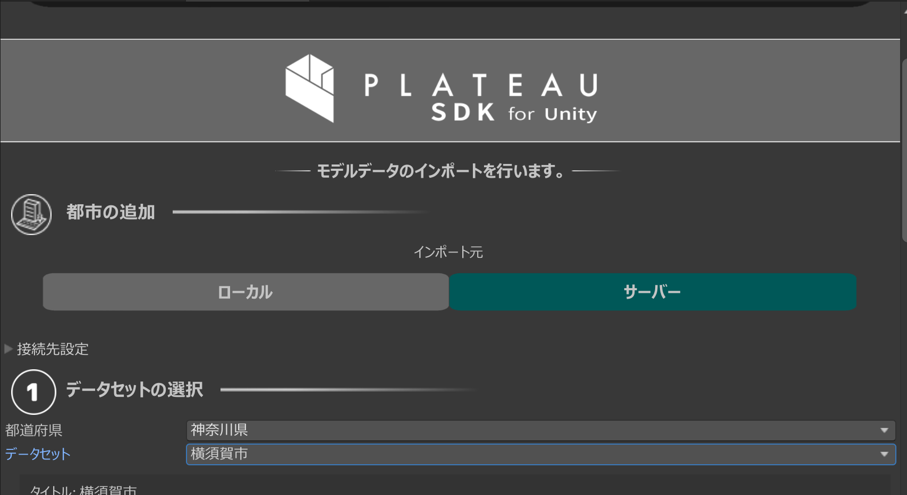
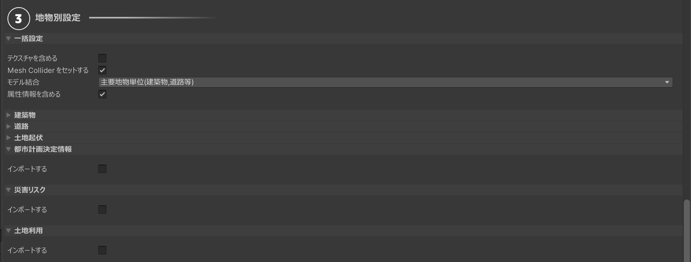
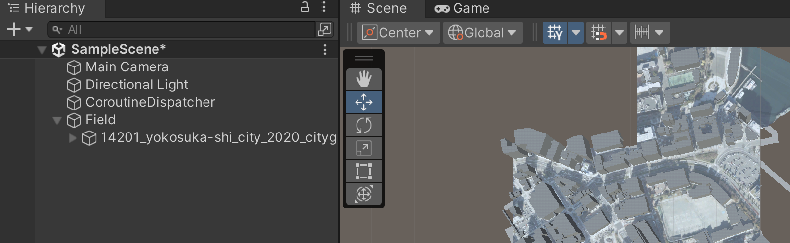
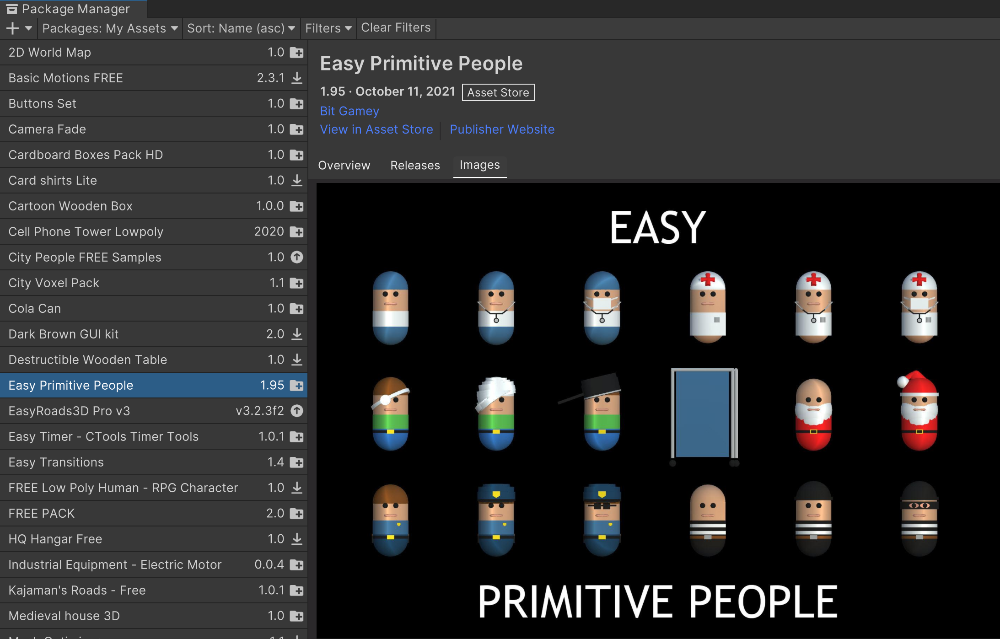
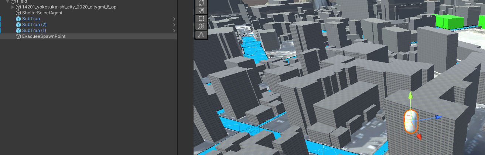

## 1. はじめに
本チュートリアルでは「AIに現実の都市空間での避難所の最適配置を考えさせる」というテーマで、強化学習AIモデルを用いて、制限時間内に避難率を最大化できる追加の避難所はどこか、ということを探索する避難シミュレーションの実装方法をハンズオン形式で解説します。

### 1-1. 強化学習とは？
強化学習とは機械学習、いわゆるAIの学習方法の１つで、通常の画像認識や音声認識のいわゆるデータ駆動型AIとは異なり、ゲーム空間などの仮想環境において、エージェント（とよばれるAI）が行動を選択し、その結果として得られる報酬（AIの選択の良し悪しを図る評価値）を最大化するように学習を行う機械学習アルゴリズムです。

強化学習は、AlphaGoなどのゲームAIや、自動運転車の制御など、状況に応じて最適な行動を選択する必要がある問題に適しています。

強化学習の学習サイクルの流れは,
観察（環境の状態）の取得 → 行動の決定 → 行動の実行 → 報酬の取得
という流れで進行し、このサイクルを繰り返すことで、AIは最適な行動を学習していきます。

### 1-2. PLATEAU × 強化学習を使うとできること
特に、強化学習は仮想環境を活用して試行錯誤を繰り返しながら学習を進めるため、3D都市モデルであるPLATEAUとの親和性が高いです。PLATEAUは、日本の都市を詳細に再現した3D空間データを提供しており、このデータをシミュレーション環境として活用することで、現実世界に近い条件でAIエージェントを訓練できます。

例えば、PLATEAUを使用すれば、自動運転車の都市内移動や災害時の避難誘導シミュレーションなど、複雑な都市環境における最適な行動選択を学習することが可能です。さらに、現実の都市空間とデータの整合性が高いため、強化学習で得られた成果を現実世界に適用する際のギャップを縮小できるというメリットがあります。

また、PLATEAUは多様な都市データ（建物、道路、地形、地下構造物など）を統合しているため、強化学習の訓練に必要な環境パラメータを自由に設定できます。これにより、単に仮想環境内の最適行動を学習するだけでなく、都市設計や政策のシミュレーション、さらにはスマートシティの実現に向けた革新的な技術開発に貢献する可能性があります。

### 1-3. 制作物の概要
本チュートリアルではPLATEAU SDK for UnityとUnityの強化学習フレームワークであるML-Agentsを使った、避難所最適配置のシミュレーションの実装を行います。

PLATEAUで提供されている3D都市モデルデータ、および付随する属性情報を活用して、避難所の最適配置を学習するAIエージェントを訓練します。AIエージェントは、都市内の避難所候補となっている建物の内、「避難者の位置分布や数」「避難所の場所や収容人数」に基づいて、どこを避難所とすれば避難完了率（制限時間内に避難できた人数）を最大化できるかを学習します。

## 2. プロジェクトの作成

### 2-1. Unityプロジェクトの作成

まずはじめに、Unity Hubを起動し、新規プロジェクトを作成します。プロジェクト名は何でも良いですが、ここでは「EvacuationSimulatorRL」とし、テンプレートは「3D」を選択します。

また、使用するUnityのバージョンですが 本チュートリアル撮影時点でLTS版の`2022.3.4f1`を使用します。
Editor Versionの欄からバージョンを選択してください。
もしここに、エディタのバージョンがない場合は、(Unityのダウンロードアーカイブサイト)[https://unity.com/ja/releases/editor/archive]から該当するエディタのバージョンを選択して、ダウンロードしてください。

### 2-2. パッケージのインストール
プロジェクトの作成が完了したら、必要なパッケージのインストールを行います。

必要なパッケージは３つあります。
1. Newtonsoft.json
   - PLATEAUの属性情報はJSON形式で提供されているため、JSON情報のシリアライズとデシリアライズを行うためのライブラリです。
2. AI Navigation
   - 後述のナビゲーションメッシュのコンポーネントを利用するためのパッケージです。
3. ML-Agents Release 21版
4. PLATEAU SDK for Unity Ver.2.3.2
   
まずは、これらのパッケージをインストールしていきます。
エディタ上部のツールバーから`「Window」→「Package Manager」`を選択します。

次に、`「+」→「Add package from git URL」`を選択し、以下のURLを入力してください。
```
https://github.com/jilleJr/Newtonsoft.Json-for-Unity.git
```

次に、ナビゲーションメッシュのコンポーネントを利用するためのパッケージ`AI Navigation`をインストールします。
先程と同様に`「Window」→「Package Manager」`を選択し、`Unity Registry`を選択してください。
検索バーに`AI Navigation`と入力し、`AI Navigation`を選択してインストールしてください。



インストールが完了したら、次にPLATEAU SDK For Unityをインストールします。今回はgitのURL指定で導入していきます。
先ほどと、同様に、`「+」→「Add package from git URL」`を選択し、以下のURLを入力してください。
```
https://github.com/Project-PLATEAU/PLATEAU-SDK-for-Unity.git#v2.3.2
```

次に、強化学習で使うML-Agentsをインストールしていきます。こちらは、Unity側で動作するパッケージとPython側で動作するパッケージの２つインストールする必要があります。

まずは、Unity側で動作するパッケージをインストールしていきます。
今回はML-Agentsのrelease 21版を利用するので、その(リリースページ)[https://github.com/Unity-Technologies/ml-agents/releases/tag/release_21]へアクセスしてください。

リリースページにアクセスしたら、下のAssetsにある`「Source Code (zip)」`をダウンロードして
、プロジェクトのルートディレクトリに解凍してください。


解答したら、先ほどと同じように,`PackageManager`を開き、`「＋」→「Add package from disk」`を選択し、先ほど解凍したフォルダの中にある`「com.unity.ml-agents/package.json」`と`「com.unity.ml-agents.extensions/package.json」`を選択してください。
これで、Unity側パッケージのインストールが完了しました。

※環境によってはインストール操作後にエディタログにエラーが表示され、パッケージが正しくインストールされない場合があります。その場合は、一度プロジェクトを閉じて再度起動すれば正しくインストールされます。

次に、Python側の環境構築とML-Agentsをインストールしていきます。
mlagentsでAIを訓練させるには、Pytorchの環境が必要になりますのでそれを整えていきます。
また、利用するML-Agentsのバージョンによって必要となるPythonのバージョンが異なりますので、リリースページに記載されているPythonのバージョンを確認するようにしてください。
Pythonのバージョンを切り替えられるツール（pyenvやrye）などを使用して環境構築することをお勧めします。

ここでは、すでにPythonの環境が整っていることを前提に、仮想環境として標準提供されている`venv`を利用した環境構築を説明します。
まずプロジェクトのルートでターミナルを開き、以下のコマンドを入力して仮想環境を作成してください。
```shell
python -m venv .venv
```
次に、仮想環境を有効化します。これはOSによりコマンドが少し異なるので、以下のコマンドを参考にしてください。
```shell
# Windows
.venv\Scripts\activate
# Mac
source .venv/bin/activate
```
プロンプトの先頭に``(.venv)``と表示されれば、仮想環境の有効化に成功しているので、次の手順へ進みます。
ML-AgentsのPythonパッケージをインストールしていきます。以下のコマンドを入力してください。
今回は、ML-Agentsの1.0.0をインストールします。
```shell
pip install mlagents==1.0.0
```
これには少し時間がかかります。
<!--protobuf等の動作に問題がある場合は、その旨説明し修正版インストール-->

#### GPUを利用する場合（NVIDIA GPU向け）
ML-Agentsは学習時や推論時にGPUを利用することができます。これは多くのケースでCPUで学習や推論を行うよりも高速に動作することがあります。
CUDAに対応しているNVIDIAのGPUをお持ちの方は、CUDA版Pytorchを別途インストールすることでGPUを利用することができます。
<!--本編とは関係ないので一旦割愛。-->

以上で実装の環境構築は完了です。次のステップに進みます。

## 3. 都市モデルのインポート
PLATEAU SDK for Unityを利用して、PLATEAUの都市モデルデータをUnityにインポートしていきます。

使用する都市はどれでも良いですが、今回はLOD2に対応している横須賀市のモデルを利用します。
上部のメニューバーから`「PLATEAU」→「PLATEAU SDK」`を選択しモデルインポート設定の画面を開きます。



モデルデータのインポート方法は任意ですが、ここではサーバーからインポートする方法を選択します。

範囲を指定したら、次の様にインポート設定を行います。
```
- 一括設定 > テクスチャを含める : チェックを外します。
- 都市計画決定情報 & 土地利用 & 災害リスク : インポートのチェックを外します。
```


インポートが完了したら、シーンビューに都市モデルが表示されることを確認してください。

完了したら、インスペクターから環境全体を管理するため、空のGameObjectを作成し、名前を`Field`としておきます。
この`Field`に、都市モデル全体を子要素として追加しておきます。


## 4. 環境全体を制御するプログラムの作成
次に、この`Field`に対して、シミュレーション環境全体を制御するプログラムを作成していきます。

Projectビュー上で、新規でC#スクリプトを作成し、名前を`ShelterEnvManager`としておきます。
エディタでこのファイルを開いて、以下のコードを記述してください。
<details>
<summary>ShelterEnvManager.cs</summary>

```csharp
/**必要な名前空間の参照*/
using System.Collections;
using System.Collections.Generic;
using UnityEngine;
using UnityEngine.AI;
using TMPro;
using PLATEAU.CityInfo;
using PLATEAU.Util;
using Newtonsoft.Json;

/// <summary>
/// シミュレータ環境全般の制御を行うクラス
/// </summary>
public class EnvManager : MonoBehaviour {
    /**シミュレーションモードの選択を定義*/
    public enum SimulateMode {
        Train, // モデル訓練
        Inference // モデル推論
    }

    public enum SpawnMode {
        Random, // 一定の範囲内でランダムに出現
        Custom, // 自身でスポーン位置・範囲を設定
    }

    [Header("Environment Settings")]
    public SimulateMode Mode = SimulateMode.Train; 
    public SpawnMode EvacSpawnMode = SpawnMode.Random; 
    public float TimeScale = 1.0f; // 推論時のシミュレーションの時間スケール
    /// <summary>
    /// 生成する避難者の人数に合わせて避難所の収容人数をスケーリングします.
    /// </summary>
    /// <example>
    /// スケーリング例:
    /// <list type="bullet">
    /// <item>
    /// <description>1.0f: 通常 → 収容人数算出式に合わせて避難所の収容人数を設定</description>
    /// </item>
    /// <item>
    /// <description>0.5f: 避難者の人数が半分 → 避難所の収容人数も半分</description>
    /// </item>
    /// </list>
    /// </example>
    public float AccSimulateScale = 1.0f; 
    public float MaxSeconds = 60.0f; // シミュレーションの最大時間（秒）
    public int SpawnEvacueeSize;
    public GameObject SpawnEvacueePref; // 避難者のプレハブ
    public float SpawnRadius = 10f; // スポーンエリアの半径
    public Vector3 spawnCenter = Vector3.zero; // スポーンエリアの中心位置

    public GameObject AgentObj;
    public ShelterManagementAgent Agent;

    [Header("Objects")]
    [System.NonSerialized]
    public List<GameObject> Evacuees; // 避難者のリスト
    [System.NonSerialized]
    public List<GameObject> CurrentShelters; // 現在のアクティブな避難所のリスト
    public List<GameObject> Shelters; // 全避難所のリスト

    [Header("UI Elements")]
    public TextMeshProUGUI stepCounter;

    // Event Listeners
    public delegate void EndEpisodeHandler(float evacueeRate);
    public EndEpisodeHandler OnEndEpisode;
    public delegate void StartEpisodeHandler();
    public StartEpisodeHandler OnStartEpisode;
    [Header("Parameters")]
    public float EvacuationRate; // 全体の避難率
    public bool EnableEnv = false; // 環境の準備が完了したか否か（利用不可の場合はfalse）
    private int currentStep;
    private float currentTimeSec;

    void Start() {
        if(Mode == SimulateMode.Inference) {
            Time.timeScale = TimeScale; // 推論時のみシミュレーションの時間スケールを設定
        }

        if(AccSimulateScale > 1.0f) {
            Debug.LogError("AccSimulateScale is greater than 1.0f. Please set the value between 0.0f and 1.0f.");
        }

        NavMesh.pathfindingIterationsPerFrame = 1000000; // パス検索の上限値を設定

        Agent = AgentObj.GetComponent<ShelterManagementAgent>();
        Evacuees = new List<GameObject>(); // 避難者のリストを初期化
        CurrentShelters = new List<GameObject>(); // 避難所のリストを初期化
        Shelters = new List<GameObject>(); // 避難所のリストを初期化
        currentStep = Agent.StepCount;

        // 避難所登録
        Shelters = new List<GameObject>(GameObject.FindGameObjectsWithTag("Shelter"));
        // 固定値の避難所を追加
        GameObject[] constSheleters = GameObject.FindGameObjectsWithTag("ConstShelter");
        foreach (var shelter in constSheleters) {
            Shelters.Add(shelter);
        }
        // コンポーネントの初期化
        foreach (var shelter in Shelters) {
            if(shelter.GetComponent<Shelter>() == null) {
                Shelter tower = shelter.AddComponent<Shelter>();
                tower.uuid = System.Guid.NewGuid().ToString();
                tower.MaxCapacity = GetAccSize(shelter);
                tower.NowAccCount = 0;
            }
        }

        /** エピソード終了時の処理*/
        OnEndEpisode += (float evacuateRate) => {
            currentTimeSec = 0; // 時間をリセット
            Agent.SetReward(evacuateRate * 100); // 避難完了率を報酬を設定
            Agent.EndEpisode(); // エピソード終了
        };
    }

    void OnDrawGizmos() {
        if(EvacSpawnMode == SpawnMode.Random) {
            Gizmos.color = Color.red;
            DrawWireCircle(spawnCenter, SpawnRadius);
        }
    }

    void FixedUpdate() {
        currentTimeSec += Time.deltaTime;
        EvacuationRate = GetCurrentEvacueeRate();
        UpdateUI();
        if (currentTimeSec >= MaxSeconds) { // 制限時間の判定
            OnEndEpisode?.Invoke(EvacuationRate); // 制限時間を超えた場合、エピソード終了のイベントを発火
        }
    }

    /// <summary>
    /// エピソード開始時の初期化処理
    /// この関数はエージェントのイベント関数から参照されます 
    /// </summary>
    public void OnEpisodeBegin() {
        EnableEnv = false;
        Dispose();
        Create();
        OnStartEpisode?.Invoke();
        EnableEnv = true;
    }

    /// <summary>
    /// 環境をリセット,破棄をする関数。
    /// - 避難者のクリア
    /// - 避難所のクリア
    /// </summary>
    public void Dispose() {
        foreach (var evacuee in Evacuees) {
            Destroy(evacuee);
        }
        Evacuees = new List<GameObject>(); // 新しいリストを作成
        CurrentShelters = new List<GameObject>(); // 新しいリストを作成
    }

    /// <summary>
    /// 環境の生成を行う関数.
    /// - 避難者のスポーン 処理
    /// </summary>
    public void Create() {
        // 避難者のスポーン
        if(EvacSpawnMode == SpawnMode.Custom) {
            GameObject[] spawnPoints = GameObject.FindGameObjectsWithTag("SpawnPos");
            foreach (var spawnPoint in spawnPoints) {
                var point = spawnPoint.GetComponent<EvacueeSpawnPoint>();
                float radius = point.SpawnRadius;
                Vector3 spawnCenter = spawnPoint.transform.position;
                Vector3 spawnPos = GetRandomPositionOnNavMesh(radius, spawnCenter);
                for (int i = 0; i < point.SpawnSize; i++) {
                    SpawnEvacuee(spawnPos);
                }
            }
        } else {
            for (int i = 0; i < SpawnEvacueeSize; i++) {
                Vector3 spawnPos = GetRandomPositionOnNavMesh(SpawnRadius, spawnCenter);
                if (spawnPos != Vector3.zero) {
                    SpawnEvacuee(spawnPos);
                }
            }
        }
    }

    /// <summary>
    /// 避難者１体を生成、登録する関数
    /// </summary>
    /// <param name="spawnPos"></param>
    private void SpawnEvacuee(Vector3 spawnPos) {
        GameObject evacuee = Instantiate(SpawnEvacueePref, spawnPos, Quaternion.identity, transform);
        evacuee.tag = "Evacuee";
        Evacuees.Add(evacuee);
    }

    /// <summary>
    /// 範囲内のナビメッシュ上の任意の座標を取得する。
    /// </summary>
    /// <returns>ランダムなナビメッシュ上の座標 or Vector3.zero</returns>
    private static Vector3 GetRandomPositionOnNavMesh(float radius, Vector3 center) {
        Vector3 randomDirection = Random.insideUnitSphere * radius; // 半径内のランダムな位置を取得
        randomDirection += center; // 中心位置を加算
        NavMeshHit hit;
        if (NavMesh.SamplePosition(randomDirection, out hit, radius, NavMesh.AllAreas)) {
            return hit.position;
        }
        return Vector3.zero; // ナビメッシュが見つからなかった場合
    }

    private void UpdateUI() {
        stepCounter.text = $"Remain Seconds : {MaxSeconds - currentTimeSec:F2}";
    }

    /// <summary>
    /// 現在の避難完了率を取得する
    /// </summary>
    /// <returns>現在の避難完了率: 0～1</returns>
    private float GetCurrentEvacueeRate() {
        int evacueeSize = Evacuees.Count;
        int evacuatedSize = 0;
        foreach (var evacuee in Evacuees) {
            if (!evacuee.activeSelf) {
                evacuatedSize++;
            }
        }
        return (float)evacuatedSize / evacueeSize;
    }


    /// <summary>
    /// 避難者のランダムスポーン範囲を描画する
    /// </summary>
    private static void DrawWireCircle(Vector3 center, float radius, int segments = 36) {
        float angle = 0f;
        float angleStep = 360f / segments;

        Vector3 prevPoint = center + new Vector3(radius, 0, 0); // 初期点

        for (int i = 1; i <= segments; i++) {
            angle += angleStep;
            float rad = Mathf.Deg2Rad * angle;

            Vector3 newPoint = center + new Vector3(Mathf.Cos(rad) * radius, 5, Mathf.Sin(rad) * radius);
            Gizmos.DrawLine(prevPoint, newPoint);

            prevPoint = newPoint; // 次の線を描画するために現在の点を更新
        }
    }


    /// <summary>
    /// 属性情報から避難所の収容人数を取得する
    /// 【計算式】
    /// 収容可能人数＝ 床総面積㎡×0.8÷1.65㎡
    /// ※出典：https://manboukama.ldblog.jp/archives/50540532.html
    /// </summary>
    /// <param name="shelterBldg">避難所のGameObject</param>
    /// <returns>避難所の収容人数(設定パラメータによりスケーリングされます)</returns>
    private int GetAccSize(GameObject shelterBldg) {
        double? totalFloorSize = null;
        // PLATEAU City Objectから、建物の高さを取得し、避難所の収容人数を動的に設定する
        var cityObjectGroup = shelterBldg.GetComponent<PLATEAUCityObjectGroup>();
        var rootCityObject = cityObjectGroup.CityObjects.rootCityObjects[0];

        // Newtonsoft.Jsonを使用して、CityObjectの属性情報クラスにデシリアライズして取得
        var cityObjectJsonStr = JsonConvert.SerializeObject(rootCityObject);
        var attributes = JsonConvert.DeserializeObject<RootObject>(cityObjectJsonStr).Attributes;
        // 属性値リストを巡回し、床総面積から収容人数を算出
        foreach(var attribute in attributes) {
            if(attribute.Key == "uro:buildingDetailAttribute") {
                foreach(var uroAttr in attribute.AttributeSetValue) { 
                    if(uroAttr.Key == "uro:totalFloorArea") {
                        if(double.TryParse(uroAttr.Value.ToString(), out double parsedValue)) {
                            totalFloorSize = parsedValue;
                        }
                    }
                    // 以下必要があれば、他の属性情報を取得する処理を追加することもできます。
                }
            }
        }

        // 結果が取得できなかった場合は0を返す
        if(totalFloorSize == null) {
            Debug.LogError("Failed to get the total floor size of the shelter building.");
            return 0;
        } else {
            // 収容可能人数＝総面積×0.8÷1.65㎡とする
            return (int)((totalFloorSize * 0.8 / 1.65) * AccSimulateScale);
        }
    }
}

```
</details>
作成が終わった保存をして、先ほど作成した`Field`オブジェクトにアタッチしてください。

次に、この後作成するプログラムで再利用する関数をまとめたユーティリティクラスを作成します。
Projectビュー上で、新規でC#スクリプトを作成し、名前を`Util`としておきます。
エディタでこのファイルを開いて、以下のコードを記述してください。
<details>
<summary>Util.cs</summary>

```csharp
using System.Collections;
using System.Collections.Generic;
using UnityEngine;
public class Utils : MonoBehaviour {
    
    /// <summary>
    /// 避難者のランダムスポーン範囲を描画する
    /// </summary>
    public static void DrawWireCircle(Vector3 center, float radius, int segments = 36) {
        float angle = 0f;
        float angleStep = 360f / segments;

        Vector3 prevPoint = center + new Vector3(radius, 0, 0); // 初期点

        for (int i = 1; i <= segments; i++) {
            angle += angleStep;
            float rad = Mathf.Deg2Rad * angle;

            Vector3 newPoint = center + new Vector3(Mathf.Cos(rad) * radius, 0, Mathf.Sin(rad) * radius);
            Gizmos.DrawLine(prevPoint, newPoint);

            prevPoint = newPoint; // 次の線を描画するために現在の点を更新
        }
    }

}
```
</details>

コンパイル後ログにエラーがでますが、まだまだ必要なプログラムが足りていないだけなので、気にせず次のステップに進みます。

### 4-1. PLATEAUの属性情報の型定義ファイルを作成する。
次に、PLATEAUの属性情報を取得するための型定義ファイルを作成します。

先ほど作成した`ShelterEnvManager.cs`で、避難所の収容人数の算出に、PLATEAUの建物オブジェクトの属性情報の１つである「建物の床総面積」を使用しています。この情報を取得し、C#でクラスにデシリアライズして処理する（生データはすべて文字列なため非常に扱いにくい）ために、属性情報が記述されているJSONデータの型定義ファイルを作成します。

Projectビュー上で、新規でC#スクリプトを作成し、名前を`CityObjectTypes.cs`としておきます。
エディタでこのファイルを開いて、以下のコードを記述してください。
<details>
<summary>CityObjectTypes.cs</summary>

```csharp
using System.Collections.Generic;
using Newtonsoft.Json;
using Newtonsoft.Json.Linq;

public class AttributeValue
{
    public string Key { get; set; }
    public string Type { get; set; }

    private object value;

    [JsonProperty("value")]
    public object Value
    {
        get => Type == "AttributeSet" ? AttributeSetValue : value;
        set
        {
            if (Type == "AttributeSet" && value is JArray jArray)
            {
                // NewTonsoftを使い、JSON配列をList<AttributeValue>に変換
                AttributeSetValue = jArray.ToObject<List<AttributeValue>>();
            }
            else
            {
                this.value = value;
            }
        }
    }

    // "type": "AttributeSet"の場合にデシリアライズされるプロパティ
    [JsonIgnore] // このプロパティはJSONに含めないというフラグ
    public List<AttributeValue> AttributeSetValue { get; private set; }
}

public class RootObject
{
    public string GmlID { get; set; }
    public List<int> CityObjectIndex { get; set; }
    public string CityObjectType { get; set; }
    public List<AttributeValue> Attributes { get; set; }
}
```
</details>

作成が終わったら保存してください。

## 5. ナビゲーションメッシュコンポーネントの`tran`への追加
次に、シミュレーション上で動作する避難者が移動するための道路を用意します。
今回は、PLATEAUの道路オブジェクト上のみを移動可能とするため、`tranオブジェクト`にナビゲーションメッシュを適用していきます。

ナビゲーションメッシュを適用する前に、まず除外範囲を設定していきます。
このままでは、フィールドの地形や他の建物上にもナビゲーションメッシュが適用されてしまい、避難者が通行可能になっていまうため、事前にこれらの除外設定を行います。

- 地形オブジェクト`dem_<オブジェクトID>`を除外設定に追加する。
  
    Hierarchyの検索ボックスに`dem`と入力し、地形オブジェクトを選択します。`Add Component`から`NavMesh Obstacle`コンポーネントを追加し、チェックマークを外してディアクティベーションします。


- 建物オブジェクト`bldg_<オブジェクトID>`を除外設定に追加する。
  
    Hierarchyの検索ボックスに`bldg`と入力し、建物オブジェクトを選択します。`Add Component`から`NavMesh Obstacle`コンポーネントを追加し、チェックマークを外してディアクティベーションします。

Hirarchyビューから、都市モデル内の道路データ`tran`と建物の入り口と道路を繋ぐ`SubTran`を検索し、`Add Component`から`NavMesh Surface`を選択します。
> このとき、`tran_<オブジェクトID>`と書かれているオブジェクトを選択すると、オブジェクト１つ１つにナビゲーションメッシュを適用することができますが、
> 個数が膨大なため非常に時間がかかります。道路全体に適用する場合は、親オブジェクトである`tran`を選択し、ナビゲーションメッシュを適用してください。

実際にナビゲーションメッシュを適用する前に、道路と建物を繋ぐ必要がありますので、次に行う避難所の設定を終えてからにします。


## 6. 避難所の作成と設定

### 6-1. マテリアルの作成
AIが避難所に指定した建物とそうでない建物を視覚的に区別するために、2色のマテリアルを作成しておきます。

色は任意ですが、今回は以下のような構成で作成します。
| 色       | 意味       |
|-----------|-----------|
| 緑  | 避難所に選定された建物   | 
| 黒   | 避難所に選定されなかった建物   |

### 6-2. 避難所の候補地の事前設定
AIがシミュレーション中に避難所として指定できる建物の候補地を事前に設定します。
下記手順を候補地の分だけ繰り返して設定していきます。

1. 避難所かそうでないかを判別するためのタグを追加します。

    任意のオブジェクトを選択し、Inspectorの上部にある`Tag > Add Tag`を選択します。
    `+`ボタンを押下し、新しいタグ名`Shelter`を追加します。

    また、このとき設定した建物を分かりやすくするため、先ほど作成したマテリアルを適用しておきます。

2. 候補地とする建物（`bldg_<オブジェクトID>`）を選択し、Inspectorから先ほど追加したタグ名`Shelter`を設定します。

3. 必要な以下のコンポーネントを建物に追加,設定します。

    次に、避難者が建物に到着したことを検知するために、当たり判定を設定します。`MeshCollider`にある,以下の項目にチェックを入れてください。
    - `Convex`
      - `Is Trigger`

4. 建物の入り口と道路を繋ぐためにPlaneオブジェクトを追加します。
    このオブジェクトの名前を`SubTran`とし、建物と道路を繋ぐように配置してください。
    このオブジェクトは、道路`tran`オブジェクトと建物オブジェクト`bldg`を接続する経路となるため、このオブジェクトにもナビゲーションメッシュを適用する必要があります。
    `Add Component`から`NavMesh Surface`を追加しておきます。

    このオブジェクトは再利用することになるので、Projectビューにドラッグしてプレハブとして保存しておきます。


### 6-3. 固定値となる避難所の設定
現実の都市空間では、既に避難所として指定されている建物が存在します。今回これらの建物は避難所として常に指定するために、固定値として設定します。
1. 固定値の避難所として指定する建物（`bldg_<オブジェクトID>`）を選択し、Inspectorから新たなタグ名`ConstShelter`を設定します。
<!--以降は6-2と同じ-->

### 6-4. ナビゲーションメッシュの適用
全てのオブジェクトの設置が完了したら、ナビゲーションメッシュを適用します。
Inspectorの検索ボックスに`tran`と入力し、`tran`オブジェクトと`SunTran`オブジェクトを選択し、先ほど追加した`NavMesh Surface`コンポーネントの`Bake`ボタンを押下してください。

追加が完了すると、道路の色が青く表示されます。この青い範囲が避難者が移動可能な範囲となります。

### 6-5. 避難所の目印となるオブジェクトの追加
建物のゲーム内での座標位置情報を扱うため、建物の子要素に目印となるcubeオブジェクトを追加します。

このとき、cubeオブジェクトは、`6-3の手順4`で追加したPlaneオブジェクト上で、建物の内側の位置に配置してください。
このオブジェクトも再利用するので、プレハブとして保存しておきます。

> デフォルトでは建物（`bldg`）の座標情報は*(X,Y,Z) = (0,0,0)*で固定されています。AIへ渡す観測情報として、建物の座標情報を取得するために、代替としてcubeオブジェクトを追加しています。

### 6-6. 避難所のプログラムの作成
次に、避難所のプログラムを作成します。
Projectビュー上で、新規でC#スクリプトを作成し、名前を`Shelter`としておきます。
エディタでこのファイルを開いて、以下のコードを記述してください。
<details>
<summary>Shelter.cs</summary>

```csharp
using System.Collections;
using System.Collections.Generic;
using UnityEngine;

/// <summary>
/// 避難所に関するスクリプト（オブジェクト１台分）
/// 現在の収容人数や、受け入れ可否等のデータを用意
/// </summary>
public class Shelter : MonoBehaviour{
    public int MaxCapacity = 10; //最大収容人数
    public int NowAccCount = 0; //現在の収容人数
    public int currentCapacity; //現在の受け入れ可能人数：最大収容人数 - 現在の収容人数

    public string uuid; //タワーの識別子

    private string LogPrefix = "shelter: ";

    /**Events */
    public delegate void AcceptRejected(int NowAccCount) ; //収容定員が超過した時に発火する
    public AcceptRejected onRejected;

    private EnvManager _env;

    void Start() {
        _env = GetComponentInParent<EnvManager>();
        _env.OnEndEpisode += (float _) => {
            NowAccCount = 0;
        };
    }

    void Update() {
        currentCapacity = MaxCapacity - NowAccCount;
        if (currentCapacity <= 0) {
            onRejected?.Invoke(NowAccCount);
        }
    }

    void OnTriggerEnter(Collider other) {
        
        Debug.Log("OnTriggerEnter Tower");
        bool isEvacuee = other.CompareTag("Evacuee");
        Debug.Log("isEvacuee?" + isEvacuee);
        if (isEvacuee) {
            Evacuee evacuee = other.GetComponent<Evacuee>();
            evacuee.Evacuation(this);
        }
    }
}

```
</details>
作成が終わったら保存してください。

## 7. 避難者キャラクターの作成
今回はAssetStore上にある、無料のキャラクターオブジェクトを利用します。
  - [Easy Primitive People](https://assetstore.unity.com/packages/3d/characters/easy-primitive-people-161846)

AssetStoreからインポートし、プロジェクトに適用します。
どのキャラクターでも構いませんが、今回使用するキャラクターは分かりやすいようにAssetフォルダ直下に配置し、名前を`Evacuee`としておきます。

このオブジェクトを選択し、タグ名を`Evacuee`に設定します。



次にこのオブジェクトに必要なコンポーネントを追加していきます。
`Evacuee`オブジェクトを選択し、以下のコンポーネントを追加します。
  - `Nav Mesh Agent` : キャラクターの移動を制御するコンポーネント
  - `Rigidbody` : 物理演算を適用を提供するコンポーネント
  - `Capsule Collider` : キャラクターの当たり判定を提供するコンポーネント

追加したら、`Nav Mesh Agent`のポーンの位置と、オブジェクトの位置が少しずれているので、これを合わせていきます.
`Evacuee`を選択しプレハブエディタを開きます。`Nav Mesh Agent`の`Base Offset`の値を１に設定してください。
こうすることで、キャラクターのポジションとポーンの位置が合致し、避難者が生成したときに道路に埋まることを防ぎます。
その他、以下の様に設定してください。
```
Base Offset : 1
// 以下は避難者同士が衝突したさいに、お互いが反対方向に向かおうとして移動できなくなるのを防ぐため。
Radius : 0.1
Quality : None

```

次に、この避難者を動かすプログラムを作成します。Projectビューから新しいスクリプトを作成し、名前を`Evacuee`としておきます。
<details>
<summary>Evacuee.cs</summary>

```csharp
using System.Collections;
using System.Collections.Generic;
using UnityEngine;
using UnityEngine.AI;

/// <summary>
/// 避難者の制御を行うクラス
/// </summary>
public class Evacuee : MonoBehaviour {
    
    [Header("Movement Target")]
    public GameObject Target; // 現在の移動目標
    private NavMeshAgent NavAgent; // NavMeshAgentコンポーネント
    private EnvManager _env; // ShelterEnvManagerの参照
    private bool isEvacuating = false; // 避難処理中のフラグ。当たり判定により発火するため、複数回避難処理が行われるのを防ぐためのフラグ
    private List<string> excludeTowers; //1度避難したタワーのUUIDを格納するリスト
    void Awake() {
        NavAgent = GetComponent<NavMeshAgent>();    
        excludeTowers = new List<string>(); 

        _env = GetComponentInParent<EnvManager>();
        _env.Agent.OnDidActioned += () => {
            // エージェントが建物を選択したことを検知して最短距離の避難所を探す
            if(this != null && this.gameObject.activeSelf) {
                List<GameObject> towers = SearchTowers();
                if(towers.Count > 0) {
                    Target = towers[0]; //最短距離のタワーを目標に設定
                    NavAgent.SetDestination(Target.transform.position);
                }
            }
        };
    }


    
    /// <summary>
    /// タグ名から避難所を検索する。フィールドに存在する全てのタワーを検索し、距離別にソートして返す
    /// </summary>
    /// <param name="excludeTowerUUIDs">除外するタワーのUUID.未指定の場合はnull</param>
    /// <returns>localField内のTowerオブジェクトのリスト</returns>
    private List<GameObject> SearchTowers(List<string> excludeTowerUUIDs = null) {
        GameObject[] towers = GameObject.FindGameObjectsWithTag("Shelter");
        GameObject[] constShelters = GameObject.FindGameObjectsWithTag("ConstShelter");
        List<GameObject> Iterates = new List<GameObject>();
        foreach (var shelter in towers) {
            Iterates.Add(shelter);
        }
        foreach (var shelter in constShelters) {
            Iterates.Add(shelter);
        }

        List<GameObject> sortedTowerPoints = new List<GameObject>();
        foreach (var tower in Iterates) {
            if(excludeTowerUUIDs != null && excludeTowerUUIDs.Contains(tower.GetComponent<Shelter>().uuid)) {
                continue;
            }
            GameObject point = tower.transform.GetChild(0).gameObject;
            sortedTowerPoints.Add(point);
        }
        // NOTE: エピソード更新時にgameObjectがnullになることがあるので、nullチェックを行う
        if(this != null) {
            sortedTowerPoints.Sort((a, b) => Vector3.Distance(a.transform.position, transform.position).CompareTo(Vector3.Distance(b.transform.position, transform.position))); 
        }
        return sortedTowerPoints;
    }

    /// <summary>
    /// 避難を行う
    /// </summary>
    public void Evacuation(Shelter tower) {
        if(isEvacuating) {
            return;
        }
        isEvacuating = true;
        if(tower.currentCapacity > 0) {
            tower.NowAccCount++;
            gameObject.SetActive(false);
        } else { //キャパシティがいっぱいの場合、次のタワーを探す
            excludeTowers.Add(tower.uuid);
            List<GameObject> towers = SearchTowers(excludeTowers);
            Debug.Log("TowersCount" + towers.Count);
            if(towers.Count > 0) {
                Target = towers[0]; //最短距離のタワーを目標に設定
                NavAgent.SetDestination(Target.transform.position);
            }
        }
        isEvacuating = false;
    }

}
```
<details>

## 8. カスタムスポーン用の避難者スポーンポイントの作成
次に、個別に避難者のスポーンポイントを設定する時に使用するスポーンポイントを作成します。
このスポーンポイントは、都市モデル内で避難者のスポーン位置を任意に指定するためのオブジェクトです。

シーンビュー上の任意の地点を選択し、`GameObject > 3D Object > Cupcel`を選択してスポーンポイントを作成します。
このオブジェクトの名前を`EvacueeSpawnPoint`としておきます。



次に、このオブジェクトに必要なプログラムを作成します。
Projectビューから新規でC#スクリプトを作成し、名前を`EvacueeSpawnPoint`としておきます。
エディタでこのファイルを開いて、以下のコードを記述してください。

<details>
<summary>EvacueeSpawnPoint.cs</summary>

```csharp
using System.Collections;
using System.Collections.Generic;
using UnityEngine;

/// <summary>
/// カスタムスポーン用のポイント
/// </summary>
public class EvacueeSpawnPoint : MonoBehaviour {
    
    public GameObject EvacueePrefab;
    public float SpawnRadius = 10f;
    public int SpawnSize = 50;

    void OnDrawGizmos() {
        Gizmos.color = Color.green;
        Utils.DrawWireCircle(transform.position, SpawnRadius);
    }


    public void SpawnEvacuee() {
        Vector3 spawnPos = transform.position + Random.insideUnitSphere * SpawnRadius;
        GameObject evacuee = Instantiate(EvacueePrefab, spawnPos, Quaternion.identity);
        evacuee.transform.parent = transform.parent;
        evacuee.tag = "Evacuee";
    }

}
```
</details>

作成が終わったら保存し、`EvacueeSpawnPoint`オブジェクトにアタッチしてください。
このオブジェクトは再利用することになるので、プレハブとして保存しておきます。

## 9. AIエージェントの作成
次に、AIエージェントを作成します。`Field`オブジェクト上で空のGameObjectを作成し、名前を`ShelterSelectAgent`としておきます。
このオブジェクトに`Add Component`から`Behavior Parameters`を追加し、以下のパラメータを設定してください。
Inspectorから`Behavior Parameters`の以下項目を設定します。
- `Behavior Parameters`
```
Behavior Name : ShelterSelect（後で設定する学習設定ファイルの参照先を記載します。）
Actions
    Continuous Actions : 0 // 今回は避難所の選択は二値分類のため、連続値による行動出力は不要。
    Discrete Branches : 9（固定値の避難所を除いた避難所の数だけ）
        Branch 0 Size : 2 （二値分類の為）
        ...(以下候補地数分設定していく)
```


次に、エージェント用スクリプトファイルの作成を行います。
Projectビューから新規でC#スクリプトを作成し、名前を`ShelterSelectAgent`としておきます。
エディタでこのファイルを開いて、以下のコードを記述してください。
<details>
<summary>ShelterSelectAgent.cs</summary>

```csharp
using System.Collections;
using System.Collections.Generic;
using System;
using UnityEngine;
using Unity.MLAgents;
using Unity.MLAgents.Actuators;
using Unity.MLAgents.Sensors;

public class ShelterManagementAgent : Agent {
    
    public GameObject[] ShelterCandidates; //エージェントが操作する避難所の候補リスト
    public Material SelectedMaterial;
    public Material NonSelectMaterial;
    public Action OnDidActioned;
    private EnvManager _env;


    void Start() {
        _env = GetComponentInParent<EnvManager>();
    }
    public override void Initialize() {
        if(ShelterCandidates.Length == 0) {
            //Debug.LogError("No shelter candidates");
            // NOTE: 予め候補地は事前に設定させておくこと
            ShelterCandidates = GameObject.FindGameObjectsWithTag("Shelter");
        }
    }

    public override void OnEpisodeBegin() {
        _env.OnEpisodeBegin();
        Debug.Log("Episode begin");
        RequestDecision();
    }

    /// <summary>
    /// 1. 各避難所候補地の位置情報
    /// 2. 各候補地が収容できる避難者の数。
    /// 3. 避難者の現在位置 
    /// </summary>
    /// <param name="sensor"></param>
    public override void CollectObservations(VectorSensor sensor) {

        foreach(GameObject shelter in ShelterCandidates) {
            Debug.Log("ShelterPos?" + shelter.transform.GetChild(0).gameObject.transform.position);
            sensor.AddObservation(shelter.transform.GetChild(0).gameObject.transform.position);
            sensor.AddObservation(shelter.GetComponent<Shelter>().currentCapacity);
        }
        // 観測のタイミングで避難者が避難してGameObjectが消えることがあるので、ここでコピーを作成
        List<GameObject> evacuees = new List<GameObject>(_env.Evacuees);
        sensor.AddObservation(evacuees.Count);

        // 避難者の位置情報を追加
        foreach(GameObject evacuee in evacuees) {
            if(evacuee != null) {
                sensor.AddObservation(evacuee.transform.position);
            } else {
                sensor.AddObservation(Vector3.zero);
            }
        }
        

    }

    public override void OnActionReceived(ActionBuffers actions) {
        var Selects = actions.DiscreteActions; //エージェントの選択。環境の候補地配列と同じ順序
        if(Selects.Length != ShelterCandidates.Length) {
            Debug.LogError("Invalid action size : 避難所候補地のサイズとエージェントの選択サイズが不一致です");
            return;
        }

        for(int i = 0; i < Selects.Length; i++) {
            int select = Selects[i]; // 0:非選択、1:選択
            GameObject Shelter = ShelterCandidates[i];
            if(select == 1) {
                _env.CurrentShelters.Add(Shelter);
                Shelter.tag = "Shelter";
                Shelter.GetComponent<MeshRenderer>().material = SelectedMaterial;
            } else if(select == 0) {
                _env.CurrentShelters.Remove(Shelter);
                Shelter.tag = "Untagged";
                Shelter.GetComponent<MeshRenderer>().material = NonSelectMaterial;
            } else {
                Debug.LogError("Invalid action");
            }
        }
        OnDidActioned?.Invoke();
    }
}

```
<details>

作成が終わったら保存して,`ShelterSelectAgent`オブジェクトにアタッチしてください。
最後にこの`ShelterSelectAgent`オブジェクトのタグに`Agent`を設定してください。


これで、一通りのプログラムの作成が完了しました。お疲れ様でした。


## 10. シミュレーション設定
### 10-1. シミュレーション環境設定
<!--ここで各スクリプトファイルのアタッチと、パラメータの設定を行う-->
各スクリプトファイルの作成が完了したら、それぞれのオブジェクトにアタッチしていきます。
- `Field`オブジェクトに`ShelterEnvManager.cs`をアタッチ（これはもう済）
- Projectビューの`Evacuee`オブジェクトに`Evacuee.cs`をアタッチ
- 先ほど設置した避難所の建物`bldg`オブジェクトに`Shelter.cs`をアタッチ
- シーンビュー上に設置した`EvacueeSpawnPoint`オブジェクトに`EvacueeSpawnPoint.cs`をアタッチ

次に、環境パラメータの設定を行います。
`Field`オブジェクトにアタッチされている`ShelterEnvManager`コンポーネントのInspectorから以下のパラメータを設定してください。
```
Mode               : Train（シミュレーションモード 訓練  の選択）
Evac Spawn Mode    : Random / Custom （避難者の生成方法の指定 ランダム / カスタム の選択）
Acc Simulate Scale : 0.01 （避難所の収容人数のスケーリング係数。生成する避難者数に合わせて適宜調節） 
Max Seconds     : 120 （シミュレーションの最大時間（秒））
Spawn Evacuee Size : 500 （生成する避難者の数）// 数が多いと処理が重くなるため、適宜調整してください。
Spawn Evacuee Pref : // 生成する避難者のプレハブ`Evacuee`を選択します。
Spawn Radius : 100 （避難者のスポーンエリアの半径）// エディタ上に赤い円で表示されます
Spawn Center : (-100,0,-100) （避難者のスポーンエリアの中心位置）
Agent : ShelterManagementAgent （エージェントのオブジェクト）
```

次に、先ほど作成した避難者の`Evacuee`オブジェクトに、`Evacuee.cs`をアタッチします。
Projectビューから,`Evacuee`オブジェクトを選択し、Inspectorへ`Evacuee.cs`をドラッグアンドドロップしてください。


次に`ShelterSelectAgent`オブジェクトにアタッチされている`ShelterManagementAgent`コンポーネントに、避難所の選択状況を示すマテリアルを割り当てます。
```
Selected Material : // 緑：選択された避難所のマテリアルを選択します。
Non Select Material : // 黒：選択されなかった避難所のマテリアルを選択します。
```


### 10-2. 学習設定ファイルの作成
次に、ニューラルネットワークモデルのハイパーパラメータの設定ファイルを作成していきます。

プロジェクト内の任意の場所に、ニューラルネットワークのハイパーパラメータの値を記載する
yamlファイルを作成します。今回は、`Assets/Config/ShelterAgent.yaml`としておきます。
<details>
<summary>ShelterAgent.yaml</summary>

```yaml
behaviors:
  ShelterSelect: # ここの名前が、ShelterManagementAgentのBehavior Nameと一致している必要があります
    trainer_type: ppo # 使用するトレーナーの種類（ここではPPO: Proximal Policy Optimization）
    hyperparameters:
      batch_size: 64 # 学習に使用するデータのバッチサイズ（1回の更新に使うデータ数）
      buffer_size: 12000 # バッファに保持する経験のサイズ（学習に使用するデータを一時保存する容量）
      learning_rate: 0.0003 # ニューラルネットワークの学習率（重みを更新する際の速度）
      beta: 0.001 # ポリシーエントロピーの正則化係数（探索の多様性を促進するために使用）
      epsilon: 0.2 # PPOクリッピング範囲（ポリシー更新の安定性を確保するための制約）
      lambd: 0.99 # GAE（Generalized Advantage Estimation）のλパラメータ（報酬の割引率に影響）
      num_epoch: 3 # バッファから何回更新を行うか（1つのデータセットを何回使用するか）
      learning_rate_schedule: linear # 学習率のスケジュール（線形に減少する設定）
    network_settings:
      normalize: true # 入力データの正規化を行うか（trueの場合、データのスケールを揃える）
      hidden_units: 128 # 各全結合レイヤーの隠れ層ユニット数（ニューラルネットワークの複雑さ）
      num_layers: 2 # ニューラルネットワークのレイヤー数（深さを表す）
      vis_encode_type: simple # 視覚観測用のエンコーダタイプ（ここでは簡易エンコーダ）
    reward_signals:
      extrinsic: # 環境からの報酬信号
        gamma: 0.99 # 割引率（将来の報酬に対する現在の価値の重み）
        strength: 1.0 # 報酬のスケール（報酬の相対的な大きさを調整）
    keep_checkpoints: 5 # 保存するチェックポイントの最大数（学習の進行を保存）
    max_steps: 500000 # 学習プロセス全体での最大ステップ数
    time_horizon: 1000 # トレーニング時のタイムホライズン（エピソード内での最大ステップ数）
    summary_freq: 10 # ログを記録する頻度（ステップ数に基づく）

```
</details>
作成が完了したら、保存をしておきます。

## 11. 学習モードの実行とモデル作成
それでは、機械学習を実行していきます。
最初の環境構築で使用した、ターミナルを開き、以下のコマンドを実行してください。
```bash
mlagents-learn Assets/Config/ShelterAgent.yaml --run-id=test --force
```
すると、以下のようなログが表示され、エディタの実行待機状態になります。
```bash
[INFO] Listening on port 5004. Start training by pressing the Play button in the Unity Editor.
```
この状態でエディタ上の再生ボタンを押すと、学習が開始されます。

## 12. モデルの分析
<!--Tensorboardの見方-->
### 12-1. 学習モードの終了
学習は任意のタイミングで止めることができます。学習を実行しているターミナルを開き、`Ctrl + C`を押下してください。
すると、以下のようなログが表示され、学習が終了します。
```bash
[INFO] Listening on port 5004. Start training by pressing the Play button in the Unity Editor.
[INFO] Exported results\test\ShelterSelect\ShelterSelect-1.onnx
[INFO] Copied results\test\ShelterSelect\ShelterSelect-1.onnx to results\test\ShelterSelect.onnx.
```
学習が終了すると、`results`ディレクトリ内に学習結果、すなわちニューラルネットワークモデルが保存されていることを確認することができます。

### 12-2. Tensorboardの起動
学習結果を分析するために、Tensorboardを起動します。
Tensorboardは、機械学習ライブラリTenorFlowのダッシュボードツールで、学習中のエージェントのパフォーマンスや学習の進行状況を可視化することができます。
これにより、モデルの最適化やパラメーターチューニングに対する示唆を得ることができます。

起動するにはターミナルを開き、以下のコマンドを実行してください。
```bash
tensorboard --logdir=./results
```
すると、ターミナルにこのようなログが表示されるので、表示されているURLをブラウザで開きます。
```
Serving TensorBoard on localhost; to expose to the network, use a proxy or pass --bind_all
TensorBoard 2.18.0 at http://localhost:6006/ (Press CTRL+C to quit)
```

### 12-3. Tensorboardの見方
それぞれのグラフの意味を解説します。
表示されるグラフの種類は、学習アルゴリズムにより多少異なりますがここでは、デフォルトの学習アルゴリズムPPOで、良く使うグラフとその見方について説明します。

#### 12-3-1. Environment
学習環境の結果に関するグラフで、ここが最も重要なグラフとなります。
- `Cumulative Reward`
  - エージェントの平均累積エピソード報酬の推移を示します。（つまりシミュレーション１回あたりの累積報酬の変化）
  - 通常、緩やかに増加するような形状が理想的です。
  - エージェントが学習を進めるにつれて、このグラフが上昇することが期待されます。
  - 今回は、エピソード終了時点での避難完了率（0%～100%）を報酬として与えていましたので、学習過程におけるその推移となります。

#### 12-3-3. Policy
ポリシー（AIが選んだ行動パターン）に関するグラフです。
- `Entropy`
  - AIエージェントの行動決定がどれだけランダムであるかを示す指標です。
  - 継続して減少することが期待されます。
  - 減少が速すぎるか、減少が遅すぎる場合はハイパーパラメータの`beta`値を調整する必要があります。

#### 12-3-3. Loss
ニューラルネットワークの損失、エラー（最適解との差）を示すグラフです。基本的に減少することが期待されます。

- `Policy Loss`
  - ポリシー（AIが選んだ行動パターン）の損失を示します。
  - この損失が減少することは、エージェントがより良い行動を選択するようになっていることを示し、学習が成功して進んでいることを示します。


## 13. モデルを使った推論シミュレーション
### 推論モードとは？
推論モードとは、**学習済みのAIモデルを使って、環境内で意思決定や行動を行うプロセス**のことを指します。

強化学習では、まずAIエージェントが試行錯誤を繰り返して環境の中で「学ぶ」プロセス（これを「学習モード」と呼びます）を行います。その後、学習が完了すると、エージェントはその経験を元に最適な行動を取れるようになります。この「学んだ結果を使って行動する」のが推論モードです。

#### 推論モードの特徴
1. **意思決定のみを行う**:
   - 学習済みモデルを使うため、新たに試行錯誤することはありません。
   - モデルはすでに「学習」しているため、即座に結果を出せます。
2. **現実世界で応用可能**:
   - シミュレーションの結果を基に、現実での意思決定や行動に応用できます。

例えば、このプロジェクトでは、学習済みモデルを使って避難者の動きをシミュレーションし、どの避難所を利用すれば効率的に避難できるかを即座に判断することが可能になります。

### 13-1. 推論用モデルの準備
学習完了後、`results`ディレクトリ内に保存されたモデルファイル（`.onnx`形式）をプロジェクトにインポートします。

1. プロジェクトの適切なフォルダ（例: `Assets/Models/`）を作成し、学習済みモデルファイル（例: `ShelterSelect.onnx`）をコピーします。
2. Unity Editorに戻り、インポートしたモデルがプロジェクトビューに表示されていることを確認します。

### 13-2. 推論モードへの切り替え
推論モードでシミュレーションを動作させるには、以下の設定を行います。

1. `ShelterSelectAgent`オブジェクトを選択し、`Behavior Parameters`の設定を変更します。
   - **Behavior Type** を `Inference Only（またはDefault）` に設定します。
   - **Model** に先ほどインポートしたモデルファイル（例: `ShelterSelect.onnx`）をドラッグアンドドロップで指定します。

2. `Field`オブジェクトを選択し、`ShelterEnvManager`コンポーネントの `Mode` を `Inference` に変更します。
    - この設定を有効にすることで、シミュレーション環境の時間スケールを調整できます。
    
### 13-3. シミュレーションの実行
設定が完了したら、Unity Editorで再生ボタンを押すことで、推論モードでシミュレーションが開始されます。

#### 推論モードで確認するポイント
- **避難者の動き**: 学習済みモデルが選定した避難所に向かって避難者が移動するかを確認します。
- **避難率の推移**: 推論結果が期待通りの避難率を達成しているかを確認します。
- **避難所の選定**: AIがどの避難所を選定したかを視覚的に確認します（設定したマテリアルによる色分け）。

### 13-4. 結果の評価
推論モードの結果を基に、以下の観点で評価を行います。
- **避難率**: 避難完了率がどの程度か。
- **エージェントの挙動**: エージェントが合理的な選択を行っているか。
- **改善点の特定**: 推論結果や、TensorBoardでの分析を考察し、必要に応じて学習環境やハイパーパラメータの見直しを行います。

これで推論モードのシミュレーション手順は完了です。


