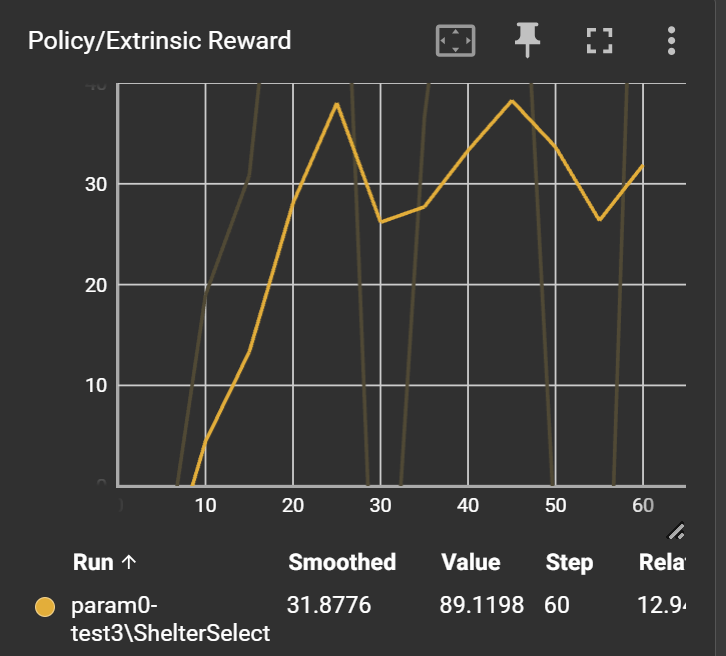
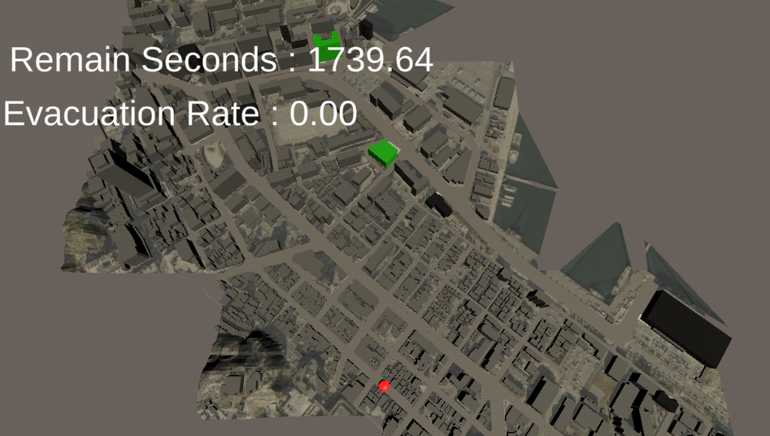
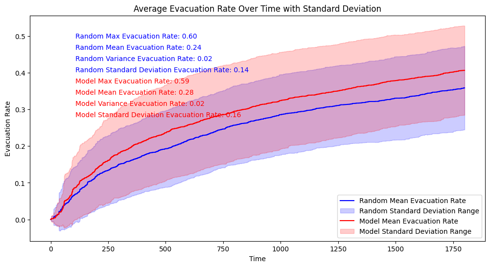
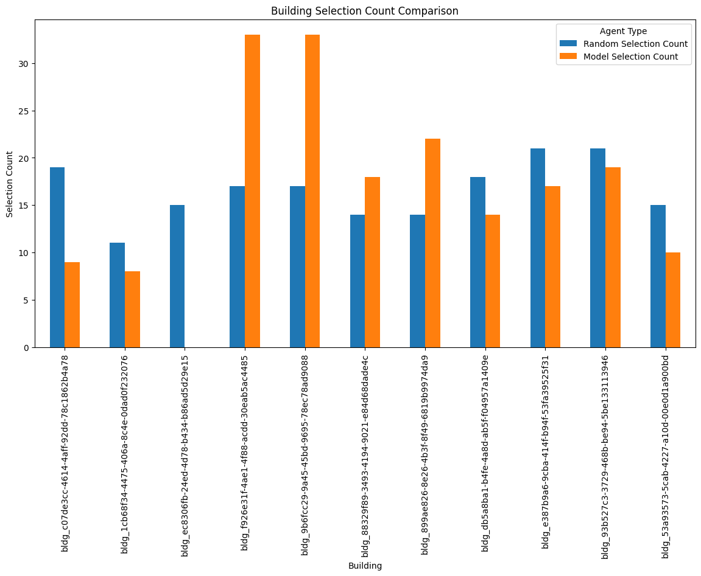
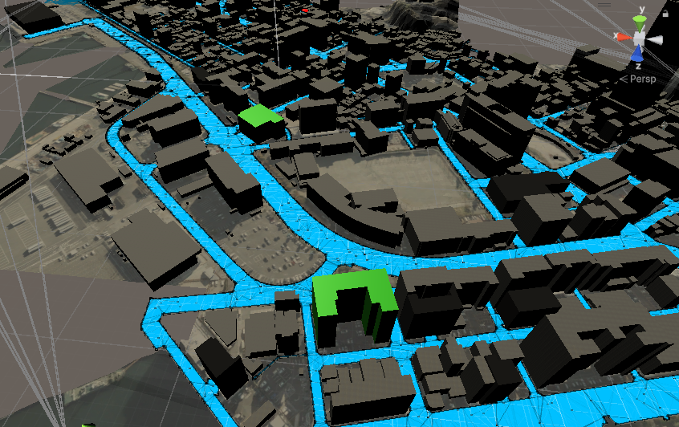
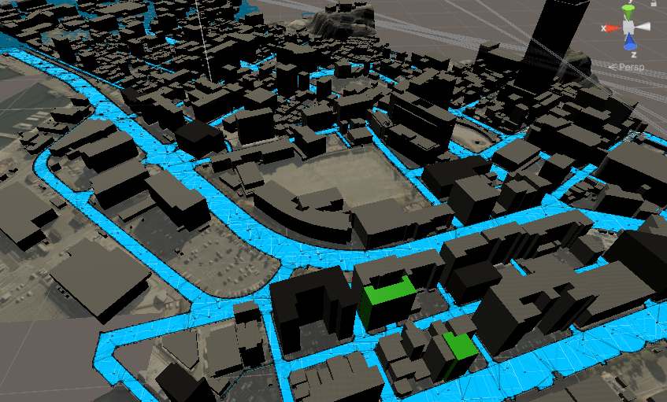
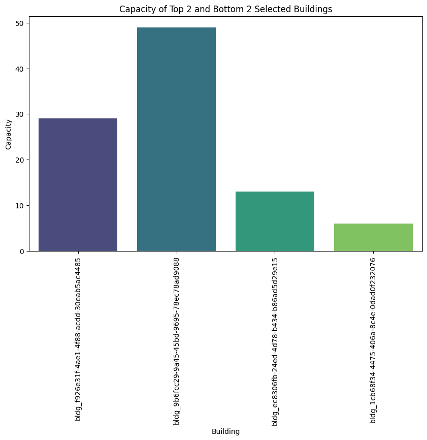
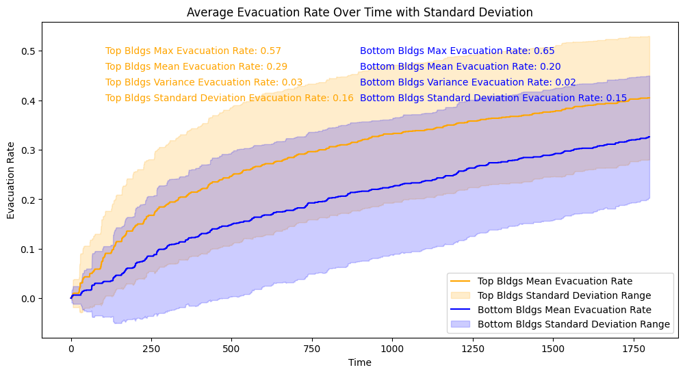

# チュートリアル① モデル分析編

## 目次
- [チュートリアル① モデル分析編](#チュートリアル-モデル分析編)
  - [目次](#目次)
  - [学習過程の分析](#学習過程の分析)
      - [累積報酬の推移](#累積報酬の推移)
  - [モデルの評価](#モデルの評価)
    - [データ記録用の処理の作成](#データ記録用の処理の作成)
    - [データ可視化用の処理の作成](#データ可視化用の処理の作成)
    - [①避難率の比較](#避難率の比較)
    - [②モデルの行動分析（避難所選択回数の比較）](#モデルの行動分析避難所選択回数の比較)
  - [上位２つの建物と下位２つの建物の比較](#上位２つの建物と下位２つの建物の比較)
    - [上位２つの建物の位置](#上位２つの建物の位置)
    - [下位２つの建物の位置](#下位２つの建物の位置)
    - [収容人数の比較](#収容人数の比較)
    - [上位２つの建物と下位２つの建物の避難率の比較](#上位２つの建物と下位２つの建物の避難率の比較)
- [結論](#結論)
## 学習過程の分析

`Tensorboardコマンド`を使用して、訓練したモデルの学習過程を可視化することができます。
下記のコマンドを実行して、学習過程を確認してみましょう。

```bash
$ tensorboard --logdir <モデルの保存先>
```

するとターミナルに下記のようなメッセージが表示されるので、表示されているURLをブラウザで開きます。
```
TensorFlow installation not found - running with reduced feature set.
Serving TensorBoard on localhost; to expose to the network, use a proxy or pass --bind_all
TensorBoard 2.18.0 at http://localhost:6006/ (Press CTRL+C to quit)
```

ブラウザで表示された画面には、下図のような学習過程のグラフが表示されます。


それぞれのグラフの説明については、割愛いたしますが、学習結果の成否を判断する上で、以下の累積報酬のグラフが重要な為、これについて少し説明します。

#### 累積報酬の推移


最も重要なグラフが、この累積報酬の推移です。
このグラフは、エージェントが環境とやり取りする中で得た報酬の合計を示しています。

強化学習はエージェントが環境の状態を観測し、行動を出力、その行動の結果として得られる報酬を最大化するように学習を進めます。

そのため、学習初期段階から比較して、学習が進むにつれて累積報酬が増加していることが望ましいです。
報酬がある一定程度の値まで増加し、収束している場合は、エージェントは何らかの法則に基づいて、安定した報酬が得られるような行動の出力を学習できたと言えます。

<details>
<summary>今回作成したモデルについての考察</summary>
今回作成したモデルの累積報酬は、学習初期段階では低い値を示しているものの、学習の進行に伴い右肩上がりになっていることが確認できます。
学習回数が20回（今回のシミュレーションでは20step目）あたりまで増加傾向を続け、その後は大きく減少することなく、横這いとなり、シミュレーション結果が安定していることを示しています。

この結果から、今回作成したモデルは、学習回数が20回（今回のシミュレーションでは20step目）あたりまでに、観測した情報から、安定した報酬（避難率）を維持するための何らかの法則を掴み、その結果に基づいて、避難所の選択を行ったと考えられます。
</details>

## モデルの評価

今回作成したモデルをランダムに建物を選択する場合（モデル無し）と比較し、最終的な避難率の結果を確認しモデルの性能を評価してみましょう。



避難者はマップ上の赤点で示した地点（今回合計５か所任意に配置）を中心に、その道路上で生成され、シミュレーション開始と同時に避難行動を開始するものとします。

### データ記録用の処理の作成
実装編で作成した、`シミュレーション環境制御プログラム`と`AI用プログラム`にそれぞれ以下のようにCSVデータとして記録する処理を実装していきます。

<details>
<summary>ＣＳＶ保存用関数</summary>

```cs
using System;
using System.IO;
using System.Collections;
using System.Collections.Generic;
using UnityEngine;

public class Utils : MonoBehaviour {
    ・・・
    public static void SaveResultCSV<T>(string[] header, List<T> dataList, Func<T, string[]> convertToCSVRow, string filePath = null, bool append = true) {

        if (filePath == null) {
            filePath = "result.csv";
        }
        // パスの先頭に指定パスを付与
        filePath = Path.Combine(Application.dataPath, filePath);
        // フォルダが存在しない場合は作成
        string dir = Path.GetDirectoryName(filePath);
        if (!Directory.Exists(dir)) {
            Directory.CreateDirectory(dir);
        }

        bool writeHeader = !File.Exists(filePath) || !append;
        using (StreamWriter writer = new StreamWriter(filePath, append)) {
            if (writeHeader) writer.WriteLine(string.Join(",", header));

            foreach (T data in dataList) {
                string[] row = convertToCSVRow(data);
                writer.WriteLine(string.Join(",", row));
            }
        }
        Debug.Log($"CSV saved: {filePath}");
    }
}
```

</details>


<details>
<summary>環境制御用：ShelterEnvManager.cs</summary>

```cs
public class EnvManager : MonoBehaviour {
    ...
    public float EvacuationRate; // 全体の避難率
    public bool EnableEnv = false; // 環境の準備が完了したか否か（利用不可の場合はfalse）
    public int currentStep;
    private float currentTimeSec;
    private List<Tuple<float, float>> evaRatePerSec = new List<Tuple<float, float>>();
    public int currentEpisodeId = 0;
    public string recordID;
    ・・・

    void Start() {
        ・・・
         // 日付-時間-分-秒を組み合わせた記録用IDを生成
        recordID = System.DateTime.Now.ToString("yyyy_MM_dd-HH_mm_ss");
        ・・・
    }

    private void OnEndEpisodeHandler(float evacuateRate) {
        ・・・
        float totalReward = evacuationRateReward + timeBonus;
        Debug.Log("Total Reward: " + totalReward);
        Agent.AddReward(totalReward);

        if(IsRecordData) {
            Utils.SaveResultCSV(
                new string[] { "Time", "EvacuationRate" }, 
                evaRatePerSec, 
                (data) => new string[] { data.Item1.ToString(), data.Item2.ToString() },
                $"{recordID}/EvaRatesPerSec_Episode_{currentEpisodeId}.csv"
            );
        }
        Agent.OnEndEpisode();

        Agent.EndEpisode();
        currentEpisodeId++;
    }
}
```
</details>
<details>
<summary>AIモデル用：ShelterAgent.cs</summary>

```cs
public class ShelterManagementAgent : Agent {
    
    public GameObject[] ShelterCandidates; //エージェントが操作する避難所の候補リスト
    public Material SelectedMaterial;
    public Material NonSelectMaterial;
    public Action OnDidActioned;
    public List<Tuple<int, int, List<bool>>> ActionLogs = new List<Tuple<int, int, List<bool>>>(); // episode, step, 各避難所候補の選択状況のリスト(true or false)
    private EnvManager _env;
    EnvironmentParameters m_ResetParams;

    public void OnEndEpisode() {
        // データの保存とActionLogsの初期化
        string[] shelterIds = new string[ShelterCandidates.Length];
        for(int i = 0; i < ShelterCandidates.Length; i++) {
            shelterIds[i] = ShelterCandidates[i].name;
        }
        string[] headers = new string[ShelterCandidates.Length + 2];
        headers[0] = "Episode";
        headers[1] = "Step";
        Array.Copy(shelterIds, 0, headers, 2, shelterIds.Length);
        Utils.SaveResultCSV(
            headers,
            ActionLogs,
            (data) => new string[] { data.Item1.ToString(), data.Item2.ToString() }.Concat(data.Item3.ConvertAll(x => x ? "1" : "0")).ToArray(),
            $"{_env.recordID}/ActionLog_Episode_{_env.currentEpisodeId}.csv"
        );
        ActionLogs.Clear();
    }


    public override void OnActionReceived(ActionBuffers actions) {
        var Selects = actions.DiscreteActions; //エージェントの選択。環境の候補地配列と同じ順序
        List<bool> selectList = new List<bool>();
        if(Selects.Length != ShelterCandidates.Length) {
            Debug.LogError("Invalid action size : 避難所候補地のサイズとエージェントの選択サイズが不一致です");
            return;
        }

        for(int i = 0; i < Selects.Length; i++) {
            int select = Selects[i]; // 0:非選択、1:選択
            GameObject Shelter = ShelterCandidates[i];
            if(select == 1) {
                _env.CurrentShelters.Add(Shelter);
                Shelter.tag = "Shelter";
                Shelter.GetComponent<MeshRenderer>().material = SelectedMaterial;
                selectList.Add(true);
            } else if(select == 0) {
                _env.CurrentShelters.Remove(Shelter);
                Shelter.tag = "Untagged";
                Shelter.GetComponent<MeshRenderer>().material = NonSelectMaterial;
                selectList.Add(false);
            } else {
                Debug.LogError("Invalid action");
            }
        }

        // 行動ログを記録（episode, step, 各避難所候補の選択状況のリスト(true or false)）
        ActionLogs.Add(new Tuple<int, int, List<bool>>(_env.currentEpisodeId, _env.currentStep, selectList));
        

        OnDidActioned?.Invoke();
    }
}

```
</details>

### データ可視化用の処理の作成
記録したCSVデータを各種グラフに可視化するためのPythonプログラムを実装していきます。
<details>
<summary>避難率推移の可視化</summary>

```py
import pandas as pd
import seaborn as sns
import matplotlib.pyplot as plt
import os
import pandas as pd
import glob
import re

RANDOM_FOLDER_PATH = "../../PLATEAUTutorial/Assets/2025_02_06-00_51_24-random"
MODEL_FOLDER_PATH = "../../PLATEAUTutorial/Assets/2025_02_06-01_34_46-model"

def load_csv_data(folder_path, pattern):
    """
    指定されたフォルダからCSVファイルを読み込み、エピソード番号を抽出してデータフレームに追加します。
    
    Parameters:
    folder_path (str): データが格納されているフォルダのパス
    pattern (str): ファイル名のパターン（正規表現）
    
    Returns:
    pd.DataFrame: 読み込んだデータを結合したデータフレーム
    """
    csv_paths = glob.glob(os.path.join(folder_path, "*.csv"))
    dfs = []

    for path in csv_paths:
        match = re.search(pattern, path)
        if match:
            episode_num = int(match.group(1))
            df = pd.read_csv(path)
            print(f"Episode {episode_num} : {len(df)}")
            df["episode"] = episode_num
            dfs.append(df)

    merged_df = pd.concat(dfs, ignore_index=True)
    return merged_df

# ランダム版のデータ読み込み
RANDOM_FOLDER_PATH = "../../PLATEAUTutorial/Assets/2025_02_06-00_51_24-random"
random_pattern = r"EvaRatesPerSec_Episode_(\d+)"
merged_random_df = load_csv_data(RANDOM_FOLDER_PATH, random_pattern)

# モデル版のデータ読み込み
MODEL_FOLDER_PATH = "../../PLATEAUTutorial/Assets/2025_02_06-01_34_46-model2"
model_pattern = r"EvaRatesPerSec_Episode_(\d+)"
merged_model_df = load_csv_data(MODEL_FOLDER_PATH, model_pattern)

# データフレームの表示
merged_random_df, merged_model_df

# エピソード番号でソート
merged_random_df = merged_random_df.sort_values("episode")
merged_model_df = merged_model_df.sort_values("episode")

# 各時間ごとの避難率の平均、分散、標準偏差を計算
evacuation_stats_random = merged_random_df.groupby('Time')['EvacuationRate'].agg(['mean', 'var', 'std']).reset_index()
evacuation_stats_model = merged_model_df.groupby('Time')['EvacuationRate'].agg(['mean', 'var', 'std']).reset_index()

# 平均値と標準偏差の範囲を計算
evacuation_stats_random['lower'] = evacuation_stats_random['mean'] - evacuation_stats_random['std']
evacuation_stats_random['upper'] = evacuation_stats_random['mean'] + evacuation_stats_random['std']
evacuation_stats_model['lower'] = evacuation_stats_model['mean'] - evacuation_stats_model['std']
evacuation_stats_model['upper'] = evacuation_stats_model['mean'] + evacuation_stats_model['std']

# グラフを作成
plt.figure(figsize=(12, 6))
sns.lineplot(data=evacuation_stats_random, x='Time', y='mean', label='Random Mean Evacuation Rate', color='blue')
plt.fill_between(evacuation_stats_random['Time'], evacuation_stats_random['lower'], evacuation_stats_random['upper'], color='blue', alpha=0.2, label='Random Standard Deviation Range')
sns.lineplot(data=evacuation_stats_model, x='Time', y='mean', label='Model Mean Evacuation Rate', color='red')
plt.fill_between(evacuation_stats_model['Time'], evacuation_stats_model['lower'], evacuation_stats_model['upper'], color='red', alpha=0.2, label='Model Standard Deviation Range')
plt.title('Average Evacuation Rate Over Time with Standard Deviation')
plt.xlabel('Time')
plt.ylabel('Evacuation Rate')
plt.legend()

# 最終的な避難率の最大値,平均値,分散,標準偏差をグラフ内に表示
max_evacuation_rate_random = merged_random_df['EvacuationRate'].max()
mean_evacuation_rate_random = merged_random_df['EvacuationRate'].mean()
var_evacuation_rate_random = merged_random_df['EvacuationRate'].var()
std_evacuation_rate_random = merged_random_df['EvacuationRate'].std()

max_evacuation_rate_model = merged_model_df['EvacuationRate'].max()
mean_evacuation_rate_model = merged_model_df['EvacuationRate'].mean()
var_evacuation_rate_model = merged_model_df['EvacuationRate'].var()
std_evacuation_rate_model = merged_model_df['EvacuationRate'].std()

plt.text(0.1, 0.9, f'Random Max Evacuation Rate: {max_evacuation_rate_random:.2f}', transform=plt.gca().transAxes, color='blue')
plt.text(0.1, 0.85, f'Random Mean Evacuation Rate: {mean_evacuation_rate_random:.2f}', transform=plt.gca().transAxes, color='blue')
plt.text(0.1, 0.8, f'Random Variance Evacuation Rate: {var_evacuation_rate_random:.2f}', transform=plt.gca().transAxes, color='blue')
plt.text(0.1, 0.75, f'Random Standard Deviation Evacuation Rate: {std_evacuation_rate_random:.2f}', transform=plt.gca().transAxes, color='blue')

plt.text(0.1, 0.7, f'Model Max Evacuation Rate: {max_evacuation_rate_model:.2f}', transform=plt.gca().transAxes, color='red')
plt.text(0.1, 0.65, f'Model Mean Evacuation Rate: {mean_evacuation_rate_model:.2f}', transform=plt.gca().transAxes, color='red')
plt.text(0.1, 0.6, f'Model Variance Evacuation Rate: {var_evacuation_rate_model:.2f}', transform=plt.gca().transAxes, color='red')
plt.text(0.1, 0.55, f'Model Standard Deviation Evacuation Rate: {std_evacuation_rate_model:.2f}', transform=plt.gca().transAxes, color='red')
```

</details>

<details>
<summary>建物選択回数の可視化</summary>

```py
import pandas as pd
import seaborn as sns
import matplotlib.pyplot as plt
import os
import pandas as pd
import glob
import re

RANDOM_FOLDER_PATH = "../../PLATEAUTutorial/Assets/2025_02_06-00_51_24-random"
MODEL_FOLDER_PATH = "../../PLATEAUTutorial/Assets/2025_02_06-01_34_46-model"

def load_csv_data(folder_path, pattern):
    """
    指定されたフォルダからCSVファイルを読み込み、エピソード番号を抽出してデータフレームに追加します。
    
    Parameters:
    folder_path (str): データが格納されているフォルダのパス
    pattern (str): ファイル名のパターン（正規表現）
    
    Returns:
    pd.DataFrame: 読み込んだデータを結合したデータフレーム
    """
    csv_paths = glob.glob(os.path.join(folder_path, "*.csv"))
    dfs = []

    for path in csv_paths:
        match = re.search(pattern, path)
        if match:
            episode_num = int(match.group(1))
            df = pd.read_csv(path)
            print(f"Episode {episode_num} : {len(df)}")
            df["episode"] = episode_num
            dfs.append(df)

    merged_df = pd.concat(dfs, ignore_index=True)
    return merged_df


# ランダム版のデータ読み込み
RANDOM_FOLDER_PATH = "../../PLATEAUTutorial/Assets/2025_02_06-00_51_24-random"
random_pattern = r"ActionLog_Episode_(\d+)"
random_action_merged_df = load_csv_data(RANDOM_FOLDER_PATH, random_pattern)

# モデル版のデータ読み込み
MODEL_FOLDER_PATH = "../../PLATEAUTutorial/Assets/2025_02_06-01_34_46-model2"
model_pattern = r"ActionLog_Episode_(\d+)"
model_action_merged_df = load_csv_data(MODEL_FOLDER_PATH, model_pattern)

# エピソード番号でソート
random_action_merged_df = random_action_merged_df.sort_values("episode")
model_action_merged_df = model_action_merged_df.sort_values("episode")

# 各建物の選択回数を計算
random_counts = random_action_merged_df.drop(columns=['Episode', 'Step', 'episode', 'type']).sum().reset_index()
random_counts.columns = ['Building', 'Random Selection Count']

model_counts = model_action_merged_df.drop(columns=['Episode', 'Step', 'episode', 'type']).sum().reset_index()
model_counts.columns = ['Building', 'Model Selection Count']

# データフレームをマージして比較
comparison_df = pd.merge(random_counts, model_counts, on='Building')

# 可視化
plt.figure(figsize=(14, 7))
comparison_df.set_index('Building').plot(kind='bar', figsize=(14, 7))
plt.title('Building Selection Count Comparison')
plt.xlabel('Building')
plt.ylabel('Selection Count')
plt.xticks(rotation=90)
plt.legend(title='Agent Type')
plt.show()

```

</details>


### ①避難率の比較
下図は、無作為にランダムに避難所を選択する場合（青）と、今回訓練したモデルによって避難所を選択させた時（赤）の経過時間あたりの避難率の推移のグラフです。



これを見ると、ランダムに避難所を選択する場合よりも、今回訓練したモデルによる避難所選択の方が若干ではありますが、全体的な避難率が向上していることが分かります。

ランダムに避難所を選択する場合は、シミュレーション終了時点の平均避難率が30%程度ですが、今回訓練したモデルによる避難所選択の場合は、シミュレーション終了時点の平均避難率が40%程度まで向上しており、10%程度モデルの方が優秀であることが伺えます。

### ②モデルの行動分析（避難所選択回数の比較）
次に,モデルがどの建物を重点的に避難所として選択したかを分析してみましょう。
下図は、ランダムの場合（青）とモデル選択（赤）による各建物ごとの、避難所に指定された回数の分布です。



このグラフから、ランダムに避難所を選択する場合と比較して、モデルは特定の建物を避難所として選択する回数が多いことが分かります。

この結果は、モデルが避難所の選択において、より効果的な戦略を学習していることを示唆しています。ランダムに選択する場合は、避難所の選択が均等に分布する傾向がありますが、モデルは特定の建物を優先的に選択することで、全体の避難率を向上させています。

このように、モデルは避難所の選択において、より効率的な方法を見つけ出し、避難率の向上に寄与していることが確認できました。今後の改善点としては、さらに多くのデータを用いてモデルを訓練し、より高い避難率を達成することが期待されます。

このモデル行動分析の結果から、この都市の避難所設置に関して次のことが言えます。
モデルが特定の建物を頻繁に選択することから、その建物が避難所として適している可能性が高いと考えることができます。
また、シミュレーション全体を通じて、全く選択されていない建物, 回数が少ない建物が存在しています。このような建物は、全体の避難率向上には寄与しなかったとモデルが学習結果から判断しているもので、そのような建物は避難所として適していない可能性があります。

このような分析は、実際の都市における避難計画を策定するときに役立つ可能性があります。


## 上位２つの建物と下位２つの建物の比較
モデルが選択した上位２つの建物と下位２つの建物について比較してみましょう。

### 上位２つの建物の位置


上位２つの建物は、大通りを挟んだ道路に面しており、比較的避難者の移動がスムーズかつ１度に大量の避難者を移動させることができたと推測できます。

### 下位２つの建物の位置


一方下位２つの建物は、比較的狭い道路に面している他、２つの建物の入り口は狭い路地を経由しないとたどり着くことができません。
そのため、避難者の移動がスムーズに行えず、避難者による混雑により避難率推移の低下を招いたと考えられます。


### 収容人数の比較 
下記のコードを実行して、上位２つの建物と下位２つの建物の収容人数を比較してみましょう。

```py
def calc_capacity(floor_size: float, scale: float=0.01) -> int:
    """収容可能人数＝総面積×0.8÷1.65㎡"""
    return int((floor_size * 0.8 / 1.65) * scale)

# 上位2つと下位2つの建物を取得
top_2_buildings = model_counts.nlargest(2, 'Model Selection Count')
bottom_2_buildings = model_counts.nsmallest(2, 'Model Selection Count')

# 床総面積を追加
top_2_buildings['FloorSize'] = [6010.55, 10125.8]  # 床面積はJSONファイルから取得
bottom_2_buildings['FloorSize'] = [2775.74, 1441.94]

# 容人数を追加
top_2_buildings['Capacity'] = top_2_buildings['FloorSize'].apply(calc_capacity)
bottom_2_buildings['Capacity'] = bottom_2_buildings['FloorSize'].apply(calc_capacity)


# 上位2つと下位2つの建物を結合
combined_buildings = pd.concat([top_2_buildings, bottom_2_buildings])

# グラフを作成
# 収容人数の比較棒グラフを作成
plt.figure(figsize=(10, 6))

sns.barplot(data=combined_buildings, x='Building', y='Capacity', palette='viridis')
plt.title('Capacity of Top 2 and Bottom 2 Selected Buildings')
plt.xlabel('Building')
plt.xticks(rotation=90)
plt.ylabel('Capacity')

plt.show()
```



このグラフから、モデルが選択した上位２つの建物は、収容人数が大きい建物であることが分かります。
一方、下位２つの建物は、収容人数が小さい建物であることが分かります。

この結果から、モデルが選択した建物は、収容人数が多い建物を優先的に選択している（訓練課程の中で収容人数が多い建物を優先的に選択することを学習した）ことが分かります。

### 上位２つの建物と下位２つの建物の避難率の比較
次に、モデルが選択した上位２つの建物と下位２つの建物のみを避難所に指定した場合のそれぞれの避難率を比較してみましょう。

下記のコードを実行して、上位２つの建物と下位２つの建物の避難率を比較してみましょう。

```py
def load_rate_data(data_path: str) -> pd.DataFrame:
    csv_paths = glob.glob(os.path.join(data_path, "*.csv"))
    dfs = []

    for path in csv_paths:
        match = re.search(r"EvaRatesPerSec_Episode_(\d+)", path)
        if match:
            episode_num = int(match.group(1))
            df = pd.read_csv(path)
            print(f"Episode {episode_num} : {len(df)}")
            df["episode"] = episode_num
            dfs.append(df)

    merged_model_df = pd.concat(dfs, ignore_index=True)
    return merged_model_df

top2_buildings_rate_data_path = "../../PLATEAUTutorial/Assets/<your_data_folder>"
bottom_2_buildings_rate_data_path = "../../PLATEAUTutorial/Assets/<your_data_folder>"

# 読み込み
top2_buildings_rate_data = load_rate_data(top2_buildings_rate_data_path)
bottom_2_buildings_rate_data = load_rate_data(bottom_2_buildings_rate_data_path)

# エピソード番号でソート
top2_buildings_rate_data = top2_buildings_rate_data.sort_values("episode")
bottom_2_buildings_rate_data = bottom_2_buildings_rate_data.sort_values("episode")

# 平均避難率を計算し比較グラフを作成
# 各時間ごとの避難率の平均、分散、標準偏差を計算
evacuation_stats_top = top2_buildings_rate_data.groupby('Time')['EvacuationRate'].agg(['mean', 'var', 'std']).reset_index()
evacuation_stats_bottom = bottom_2_buildings_rate_data.groupby('Time')['EvacuationRate'].agg(['mean', 'var', 'std']).reset_index()
# 平均値と標準偏差の範囲を計算
evacuation_stats_top['lower'] = evacuation_stats_top['mean'] - evacuation_stats_top['std']
evacuation_stats_top['upper'] = evacuation_stats_top['mean'] + evacuation_stats_top['std']
evacuation_stats_bottom['lower'] = evacuation_stats_bottom['mean'] - evacuation_stats_bottom['std']
evacuation_stats_bottom['upper'] = evacuation_stats_bottom['mean'] + evacuation_stats_bottom['std']

# グラフを作成
plt.figure(figsize=(12, 6))
sns.lineplot(data=evacuation_stats_top, x='Time', y='mean', label='Top Bldgs Mean Evacuation Rate', color='orange')
plt.fill_between(evacuation_stats_top['Time'], evacuation_stats_top['lower'], evacuation_stats_top['upper'], color='orange', alpha=0.2, label='Top Bldgs Standard Deviation Range')
sns.lineplot(data=evacuation_stats_bottom, x='Time', y='mean', label='Bottom Bldgs Mean Evacuation Rate', color='blue')
plt.fill_between(evacuation_stats_bottom['Time'], evacuation_stats_bottom['lower'], evacuation_stats_bottom['upper'], color='blue', alpha=0.2, label='Bottom Bldgs Standard Deviation Range')
plt.title('Average Evacuation Rate Over Time with Standard Deviation')
plt.xlabel('Time')
plt.ylabel('Evacuation Rate')
plt.legend()

# 最終的な避難率の最大値,平均値,分散,標準偏差をグラフ内に表示
max_evacuation_rate_top = top2_buildings_rate_data['EvacuationRate'].max()
mean_evacuation_rate_top = top2_buildings_rate_data['EvacuationRate'].mean()
var_evacuation_rate_top = top2_buildings_rate_data['EvacuationRate'].var()
std_evacuation_rate_top = top2_buildings_rate_data['EvacuationRate'].std()

max_evacuation_rate_bottom = bottom_2_buildings_rate_data['EvacuationRate'].max()
mean_evacuation_rate_bottom = bottom_2_buildings_rate_data['EvacuationRate'].mean()
var_evacuation_rate_bottom = bottom_2_buildings_rate_data['EvacuationRate'].var()
std_evacuation_rate_bottom = bottom_2_buildings_rate_data['EvacuationRate'].std()


plt.text(0.1, 0.9, f'Top Bldgs Max Evacuation Rate: {max_evacuation_rate_top:.2f}', transform=plt.gca().transAxes, color='orange')
plt.text(0.1, 0.85, f'Top Bldgs Mean Evacuation Rate: {mean_evacuation_rate_top:.2f}', transform=plt.gca().transAxes, color='orange')
plt.text(0.1, 0.8, f'Top Bldgs Variance Evacuation Rate: {var_evacuation_rate_top:.2f}', transform=plt.gca().transAxes, color='orange')
plt.text(0.1, 0.75, f'Top Bldgs Standard Deviation Evacuation Rate: {std_evacuation_rate_top:.2f}', transform=plt.gca().transAxes, color='orange')

plt.text(0.5, 0.9, f'Bottom Bldgs Max Evacuation Rate: {max_evacuation_rate_bottom:.2f}', transform=plt.gca().transAxes, color='blue')
plt.text(0.5, 0.85, f'Bottom Bldgs Mean Evacuation Rate: {mean_evacuation_rate_bottom:.2f}', transform=plt.gca().transAxes, color='blue')
plt.text(0.5, 0.8, f'Bottom Bldgs Variance Evacuation Rate: {var_evacuation_rate_bottom:.2f}', transform=plt.gca().transAxes, color='blue')
plt.text(0.5, 0.75, f'Bottom Bldgs Standard Deviation Evacuation Rate: {std_evacuation_rate_bottom:.2f}', transform=plt.gca().transAxes, color='blue')

plt.show()
```



このグラフから、モデルが選出した上位２つの建物を選択した場合、最終的な避難率は、下位２つの建物を選択した場合と比較して、より高い避難率を示していることが分かります。
また、全体的な推移も、下位２つの建物を選択した場合と比べ高く、安定していることが分かります。

結果として、上位２つの建物を避難所として指定した場合の、シミュレーション終了時の避難率（今回のモデルの報酬）がモデル学習時の累積報酬が安定してきた段階と同程度(40%程度)であることから、これら上位2つの建物が避難率（モデルの報酬）の最大化に大きく寄与していることが伺え、モデルは学習シミュレーションを通じてこれらの建物を避難所として選択することを学習したと考えられます。

# 結論
モデルを適切に学習させることで、ランダム選択よりも効果的に避難所を選択し、全体の避難率を向上できる可能性が示唆されました。
また、モデルの学習結果を分析することで、避難所として適切な建物を選定できることを示すことができました。

展望として、車両や信号などを配置し現実に近い交通状況を再現したりすることで、より実践的な避難シミュレーションの構築を目指すことができ、現実世界での結果の再現性を高めることができます。
また、モデルのチューニングや、PLATEAUで利用可能な他の属性情報と組み合わせた分析を行う事で、より効果的な避難計画の策定に役立つ可能性があります。


