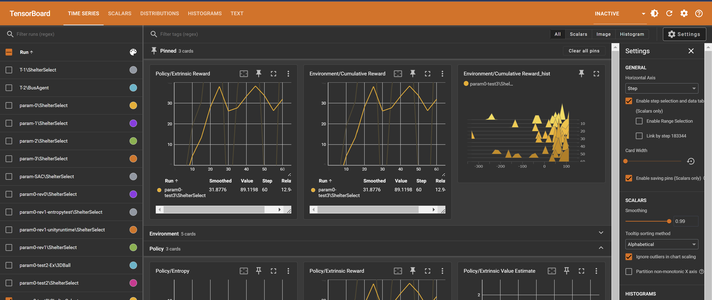

# チュートリアル① モデル分析

## 目次

## 学習過程の分析

`Tensorboardコマンド`を使用して、訓練したモデルの学習過程を可視化することができます。
下記のコマンドを実行して、学習過程を確認してみましょう。

```bash
$ tensorboard --logdir <モデルの保存先>
```

するとターミナルに下記のようなメッセージが表示されるので、表示されているURLをブラウザで開きます。
```
TensorFlow installation not found - running with reduced feature set.
Serving TensorBoard on localhost; to expose to the network, use a proxy or pass --bind_all
TensorBoard 2.18.0 at http://localhost:6006/ (Press CTRL+C to quit)
```

ブラウザで表示された画面には、下図のような学習過程のグラフが表示されます。


それぞれのグラフの説明については、割愛いたしますが、学習結果の成否を判断する上で、以下の累積報酬のグラフが重要な為、これについて少し説明します。

#### 累積報酬の推移


最も重要なグラフが、この累積報酬の推移です。
このグラフは、エージェントが環境とやり取りする中で得た報酬の合計を示しています。

強化学習はエージェントが環境の状態を観測し、行動を出力、その行動の結果として得られる報酬を最大化するように学習を進めます。

そのため、学習初期段階から比較して、学習が進むにつれて累積報酬が増加していることが望ましいです。
報酬がある一定程度の値まで増加し、収束している場合は、エージェントは何らかの法則に基づいて、安定した報酬が得られるような行動の出力を学習できたと言えます。

<details>
<summary>今回作成したモデルについての考察</summary>
今回作成したモデルの累積報酬は、学習初期段階では低い値を示しているものの、学習の進行に伴い右肩上がりになっていることが確認できます。
学習回数が20回（今回のシミュレーションでは20step目）あたりまで増加傾向を続け、その後は大きく減少することなく、横這いとなり、シミュレーション結果が安定していることを示しています。

この結果から、今回作成したモデルは、学習回数が20回（今回のシミュレーションでは20step目）あたりまでに、観測した情報から、安定した報酬（避難率）を維持するための何らかの法則を掴み、その結果に基づいて、避難所の選択を行ったと考えられます。
</details>

## モデルの評価

今回作成したモデルをランダムに建物を選択する場合（モデル無し）と比較し、最終的な避難率の結果を確認しモデルの性能を評価してみましょう。

### データ記録用の処理の作成
実装編で作成した、`シミュレーション環境制御プログラム`と`AI用プログラム`にそれぞれ以下の

### データ可視化用の処理の作成

### ①避難率の比較
下図は、無作為にランダムに避難所を選択する場合（青）と、今回訓練したモデルによって避難所を選択させた時（赤）の経過時間あたりの避難率の推移のグラフです。


これを見ると、ランダムに避難所を選択する場合よりも、今回訓練したモデルによる避難所選択の方が若干ではありますが、全体的な避難率が向上していることが分かります。

ランダムに避難所を選択する場合は、シミュレーション終了時点の平均避難率が30%程度ですが、今回訓練したモデルによる避難所選択の場合は、シミュレーション終了時点の平均避難率が40%程度まで向上しており、10%程度モデルの方が優秀であることが伺えます。

### ②モデルの行動分析（避難所選択回数の比較）
次に,モデルがどの建物を重点的に避難所として選択したかを分析してみましょう。
下図は、ランダムの場合（青）とモデル選択（赤）による各建物ごとの、避難所に指定された回数の分布です。


このグラフから、ランダムに避難所を選択する場合と比較して、モデルは特定の建物を避難所として選択する回数が多いことが分かります。

この結果は、モデルが避難所の選択において、より効果的な戦略を学習していることを示唆しています。ランダムに選択する場合は、避難所の選択が均等に分布する傾向がありますが、モデルは特定の建物を優先的に選択することで、全体の避難率を向上させています。

このように、モデルは避難所の選択において、より効率的な方法を見つけ出し、避難率の向上に寄与していることが確認できました。今後の改善点としては、さらに多くのデータを用いてモデルを訓練し、より高い避難率を達成することが期待されます。

このモデル行動分析の結果から、この都市の避難所設置に関して次のことが言えます。
モデルが特定の建物を頻繁に選択することから、その建物が避難所として適している可能性が高いと考えることができます。
また、シミュレーション全体を通じて、全く選択されていない建物, 回数が少ない建物が存在しています。このような建物は、全体の避難率向上には寄与しなかったとモデルが学習結果から判断しているもので、そのような建物は避難所として適していない可能性があります。

このような分析は、実際の都市における避難計画を策定するときに役立つ可能性があります。


