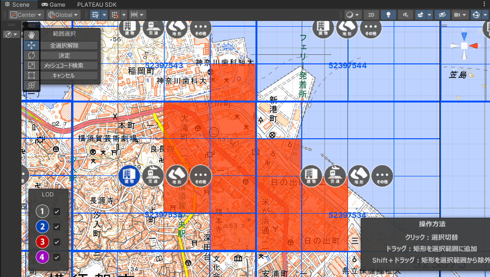
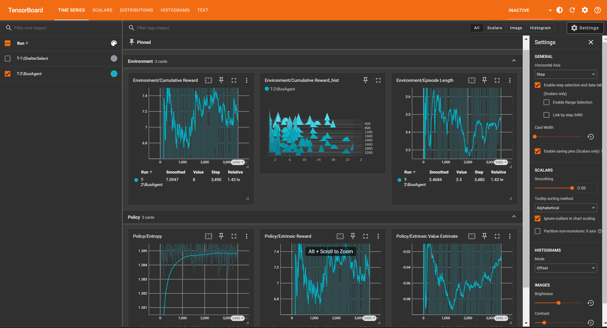

# PLATEAU チュートリアル <br> 避難所配置の最適化シミュレーション 実装ガイド

# 目的
津波や洪水等の災害発生時において、最適な避難所の配置計画を作成することを目指します。避難時間や避難率の最適化を目標に、AIに都市モデル内でどの建物を避難所にすべきかを学習させ、動的に変化する避難者の配置分布から最適な避難所配置を導きます。

# 作成環境
- Unity 2022.3.4f1
- ML-Agents toolkit Release 21
- PLATEAU SDK for Unity 2.3.2
- Windows 11

# 事前準備
## Unityのインストール
Unityアカウントを作成し、Unity Hubをインストールします。
[Unity Hub](https://unity.com/ja/download)のダウンロードページを開き、お使いのOSに合わせたバージョンをインストールしてください。

Unity Hubインストール後、Unity Hubを起動し、`インストール`タブから`Unity 2022.3.4f1`をインストールします。


インストールが完了したら、`プロジェクト`タブから`新規`を選択し、`Unity 2022.3.4f1`を選択してプロジェクトを作成します。

## ML-Agentsのインストール
Unityのプロジェクトを作成したら、ML-Agentsをインストールします。
インストールガイドは[こちら](https://github.com/Unity-Technologies/ml-agents/blob/develop/docs/Getting-Started.md)

# 実装手順

## 1.モデル都市のインポート
PLATEAU SDKより、使用したい都市モデルをインポートします。

※今回は題材として、横須賀市市役所周辺のモデルをインポートします。



インポート後、全体制御用のGameObjectを作成します。名前は任意ですが、今回は`Field`としておきます。


## 2. 必要素材の準備
### 2-1. 避難者のプレハブの作成
1. オブジェクトのインポート

    今回はAssetStore上にある、無料のキャラクターオブジェクトを利用します。
    - [Easy Primitive People](https://assetstore.unity.com/packages/3d/characters/easy-primitive-people-161846)

    AssetStoreからインポートし、プロジェクトに適用します。
    どのキャラクターでも構いませんが、今回使用するキャラクターは分かりやすいようにAssetフォルダ直下に配置し、名前を`Evacuee`としておきます。

2. 必要コンポーネントの追加
    `Evacuee`オブジェクトを選択し、以下のコンポーネントを追加します。
    - `Nav Mesh Agent` : キャラクターの移動を制御するコンポーネント
    - `Rigidbody` : 物理演算を適用を提供するコンポーネント
    - `Capsule Collider` : キャラクターの当たり判定を提供するコンポーネント

    

### 2-2. マテリアルの作成
AIが避難所に指定した建物とそうでない建物を視覚的に区別するために、2色のマテリアルを作成しておきます。

色は任意ですが、今回は以下のような構成で作成します。
| 色       | 意味       |
|-----------|-----------|
| 緑  | 避難所に選定された建物   | 
| 黒   | 避難所に選定されなかった建物   |


## 3. 避難所の候補地の事前設定
AIがシミュレーション中に避難所として指定できる建物の候補地を事前に設定します。
下記手順を候補地の分だけ繰り返して設定していきます。

1. 避難所かそうでないかを判別するためのタグを追加します。

    任意のオブジェクトを選択し、Inspectorの上部にある`Tag > Add Tag`を選択します。
    `+`ボタンを押下し、新しいタグ名`Shelter`を追加します。

    

2. 候補地とする建物（`bldg_<オブジェクトID>`）を選択し、Inspectorから先ほど追加したタグ名`Shelter`を設定します。
    

3. 必要な以下のコンポーネントを建物に追加,設定します。
    建物オブジェクトを選択した状態で、Inspector下部にある`Add Component`を押下し、以下のコンポーネントを追加してください。
    - `NavMeshObstacle` : 後述する`ナビゲーションメッシュの適用`際に必要です。追加した後は、チェックマークを外し、ディアクティベーションしてください。

    次に、避難者が建物に到着したことを検知するために、当たり判定を設定します。`MeshCollider`にある,以下の項目にチェックを入れてください。
    - `Convex`
      - `Is Trigger`
    
    

4. 建物の入り口と道路を繋ぐためにPlaneオブジェクトを追加します。
    このオブジェクトの名前を`SubTran`とし、建物と道路を繋ぐように配置してください。
    

5. 建物のゲーム内での座標位置情報を扱うため、建物の子要素に目印となるcubeオブジェクトを追加します。

    このとき、cubeオブジェクトは、`手順4`で追加したPlaneオブジェクト上で、建物の内側の位置に配置してください。

    > デフォルトでは建物（`bldg`）の座標情報は*(X,Y,Z) = (0,0,0)*で固定されています。AIへ渡す観測情報として、建物の座標情報を取得するために、代替としてcubeオブジェクトを追加しています。
    
    


## 4. 避難者が移動する経路を作る（tranへのナビゲーションメッシュの適用）

1. ナビゲーションメッシュを適用する前に、除外範囲を設定します。
    このままでは、フィールドの地形や他の建物上にもナビゲーションメッシュが適用されてしまい、避難者が通行可能になっていまうため、事前にこれらの除外設定を行います。

    - 地形オブジェクト`dem_<オブジェクトID>`を除外設定に追加する。
  
        Hierarchyの検索ボックスに`dem`と入力し、地形オブジェクトを選択します。`Add Component`から`NavMesh Obstacle`コンポーネントを追加し、チェックマークを外してディアクティベーションします。
        

    - 建物オブジェクト`bldg_<オブジェクトID>`を除外設定に追加する。
  
        Hierarchyの検索ボックスに`bldg`と入力し、建物オブジェクトを選択します。`Add Component`から`NavMesh Obstacle`コンポーネントを追加し、チェックマークを外してディアクティベーションします。
        

2. 避難者が移動する経路を作成するために、都市モデル内の道路データに、ナビゲーションメッシュを適用します。
    > ナビゲーションメッシュとは
    > NPCの移動可能領域を設定するUnityの機能です。ナビゲーションメッシュを適用することで、NPCが移動可能な範囲を設定し、移動経路を計算することができます。

    Hirarchyビューから、都市モデル内の道路データ`tran`と建物の入り口と道路を繋ぐ`SubTran`を検索し、`Add Component`から`NavMesh Surface`を選択します。

    

    > このとき、`tran_<オブジェクトID>`と書かれているオブジェクトを選択すると、オブジェクト１つ１つにナビゲーションメッシュを適用することができますが、個数が膨大なため非常に時間がかかります。道路全体に適用する場合は、親オブジェクトである`tran`を選択し、ナビゲーションメッシュを適用してください。

    `NavMesh Surface`コンポーネントを追加したら、`Bake`ボタンを押下し、ナビゲーションメッシュを生成・適用します。

    

## 4. プログラムファイルの作成
ここからは、C# 用いて、AIやシミュレーションの挙動を制御するスクリプトファイルを作成します。

### 4-1. 避難者用プログラムの作成
- Evacuee.cs 
    ```cs
    using System.Collections;
    using System.Collections.Generic;
    using UnityEngine;
    using UnityEngine.AI;

    /// <summary>
    /// 避難者の制御を行うクラス
    /// </summary>
    public class Evacuee : MonoBehaviour {
        
        [Header("Movement Target")]
        public GameObject Target;
        private NavMeshAgent NavAgent;
        private EnvManager _env;
        private bool isEvacuating = false; // 避難処理中のフラグ。当たり判定により発火するため、複数回避難処理が行われるのを防ぐためのフラグ
        private List<string> excludeTowers; //1度避難したタワーのUUIDを格納するリスト
        void Awake() {
            NavAgent = GetComponent<NavMeshAgent>();    
            excludeTowers = new List<string>(); //初期化

            _env = GetComponentInParent<EnvManager>();
            _env.Agent.OnDidActioned += () => {
                Debug.Log("OnDidActioned");
                // 最短距離の避難所を探す
                if(this != null && this.gameObject.activeSelf) {
                    List<GameObject> towers = SearchTowers();
                    if(towers.Count > 0) {
                        Target = towers[0]; //最短距離のタワーを目標に設定
                        NavAgent.SetDestination(Target.transform.position);
                    }
                }
            };
        }


        
        /// <summary>
        /// タグ名から避難所を検索する。フィールドに存在する全てのタワーを検索し、距離別にソートして返す
        /// </summary>
        /// <param name="excludeTowerUUIDs">除外するタワーのUUID.未指定の場合はnull</param>
        /// <returns>localField内のTowerオブジェクトのリスト</returns>
        private List<GameObject> SearchTowers(List<string> excludeTowerUUIDs = null) {
            GameObject[] towers = GameObject.FindGameObjectsWithTag("Shelter");
            List<GameObject> sortedTowerPoints = new List<GameObject>();
            foreach (var tower in towers) {
                if(excludeTowerUUIDs != null && excludeTowerUUIDs.Contains(tower.GetComponent<Tower>().uuid)) {
                    continue;
                }
                GameObject point = tower.transform.GetChild(0).gameObject;
                sortedTowerPoints.Add(point);
            }
            // NOTE: エピソード更新時にgameObjectがnullになることがあるので、nullチェックを行う
            if(this != null) {
                sortedTowerPoints.Sort((a, b) => Vector3.Distance(a.transform.position, transform.position).CompareTo(Vector3.Distance(b.transform.position, transform.position))); 
            }
            return sortedTowerPoints;
        }

        /// <summary>
        /// 避難を行う
        /// </summary>
        public void Evacuation(Tower tower) {
            if(isEvacuating) {
                return;
            }
            isEvacuating = true;
            if(tower.currentCapacity > 0) {
                tower.NowAccCount++;
                gameObject.SetActive(false);
            } else { //キャパシティがいっぱいの場合、次のタワーを探す
                excludeTowers.Add(tower.uuid);
                List<GameObject> towers = SearchTowers(excludeTowers);
                Debug.Log("TowersCount" + towers.Count);
                if(towers.Count > 0) {
                    Target = towers[0]; //最短距離のタワーを目標に設定
                    NavAgent.SetDestination(Target.transform.position);
                }
            }
            isEvacuating = false;
        }

    }
    ```
    作成後、Assetsフォルダ内にある`Evacuee`オブジェクトにアタッチしてください。

### 4-2. 避難所建物用プログラムの作成
- Shelter.cs
  ```cs
  using System.Collections;
    using System.Collections.Generic;
    using UnityEngine;

    /// <summary>
    /// 避難所に関するスクリプト（オブジェクト１台分）
    /// 現在の収容人数や、受け入れ可否等のデータを用意
    /// </summary>
    public class Tower : MonoBehaviour{
        public int MaxCapacity = 10; //最大収容人数
        public int NowAccCount = 0; //現在の収容人数
        public int currentCapacity; //現在の受け入れ可能人数：最大収容人数 - 現在の収容人数

        public string uuid; //タワーの識別子

        private string LogPrefix = "Tower: ";

        /**Events */
        public delegate void AcceptRejected(int NowAccCount) ; //収容定員が超過した時に発火する
        public AcceptRejected onRejected;

        private EnvManager _env;

        void Start() {
            _env = GetComponentInParent<EnvManager>();
            _env.OnEndEpisode += (float _) => {
                NowAccCount = 0;
            };
        }

        void Update() {
            currentCapacity = MaxCapacity - NowAccCount;
            if (currentCapacity <= 0) {
                onRejected?.Invoke(NowAccCount);
            }
        }

        void OnTriggerEnter(Collider other) {
            
            Debug.Log("OnTriggerEnter Tower");
            bool isEvacuee = other.CompareTag("Evacuee");
            Debug.Log("isEvacuee?" + isEvacuee);
            if (isEvacuee) {
                Evacuee evacuee = other.GetComponent<Evacuee>();
                evacuee.Evacuation(this);
            }
            
            
        }
    }

  ```
  作成後、シーン内に設定した各避難所の建物オブジェクトにアタッチしてください。

### 4-3. AIプログラムの作成
- ShelterAgent.cs
  ```cs
    using System.Collections;
    using System.Collections.Generic;
    using System;
    using UnityEngine;
    using Unity.MLAgents;
    using Unity.MLAgents.Actuators;
    using Unity.MLAgents.Sensors;

    public class ShelterManagementAgent : Agent {
        
        public GameObject[] ShelterCandidates;
        public Material SelectedMaterial;
        public Material NonSelectMaterial;
        public Action OnDidActioned;
        private EnvManager _env;


        void Start() {
            _env = GetComponentInParent<EnvManager>();
        }
        public override void Initialize() {
            if(ShelterCandidates.Length == 0) {
                //Debug.LogError("No shelter candidates");
                // NOTE: 予め候補地は事前に設定させておくこと
                ShelterCandidates = GameObject.FindGameObjectsWithTag("Shelter");
            }
        }

        public override void OnEpisodeBegin() {
            _env.OnEpisodeBegin();
            Debug.Log("Episode begin");
            RequestDecision();
        }

        /// <summary>
        /// 1. 各避難所候補地の位置情報
        /// 2. 各候補地が収容できる避難者の数。
        /// 3. 避難者の現在位置 
        /// </summary>
        /// <param name="sensor"></param>
        public override void CollectObservations(VectorSensor sensor) {

            foreach(GameObject shelter in ShelterCandidates) {
                Debug.Log("ShelterPos?" + shelter.transform.GetChild(0).gameObject.transform.position);
                sensor.AddObservation(shelter.transform.GetChild(0).gameObject.transform.position);
                sensor.AddObservation(shelter.GetComponent<Tower>().currentCapacity);
            }
            // 観測のタイミングで避難者が避難してGameObjectが消えることがあるので、ここでコピーを作成
            List<GameObject> evacuees = new List<GameObject>(_env.Evacuees);
            sensor.AddObservation(evacuees.Count);

            // 避難者の位置情報を追加
            foreach(GameObject evacuee in evacuees) {
                if(evacuee != null) {
                    sensor.AddObservation(evacuee.transform.position);
                } else {
                    sensor.AddObservation(Vector3.zero);
                }
            }
            

        }

        public override void OnActionReceived(ActionBuffers actions) {
            var Selects = actions.DiscreteActions; //エージェントの選択。環境の候補地配列と同じ順序
            if(Selects.Length != ShelterCandidates.Length) {
                Debug.LogError("Invalid action size : 避難所候補地のサイズとエージェントの選択サイズが不一致です");
                return;
            }

            for(int i = 0; i < Selects.Length; i++) {
                int select = Selects[i]; // 0:非選択、1:選択
                GameObject Shelter = ShelterCandidates[i];
                if(select == 1) {
                    _env.Shelters.Add(Shelter);
                    Shelter.tag = "Shelter";
                    Shelter.GetComponent<MeshRenderer>().material = SelectedMaterial;
                } else if(select == 0) {
                    _env.Shelters.Remove(Shelter);
                    Shelter.tag = "Untagged";
                    Shelter.GetComponent<MeshRenderer>().material = NonSelectMaterial;
                } else {
                    Debug.LogError("Invalid action");
                }
            }
            OnDidActioned?.Invoke();
        }


    }

  ```
  シーン内の`ShelterManagementAgent`オブジェクトにアタッチしてください。

### 4-4. シミュレーション制御プログラムの作成
- ShelterEnvManager.cs
    ```cs
    using System.Collections;
    using System.Collections.Generic;
    using UnityEngine;
    using UnityEngine.AI;
    using TMPro;

    /// <summary>
    /// シミュレータ環境全般の制御を行うクラス
    /// </summary>
    public class EnvManager : MonoBehaviour {

        [Header("Environment Settings")]
        public float MaxSeconds = 60.0f; // シミュレーションの最大時間（秒）
        public int SpawnEvacueeSize;
        public GameObject SpawnEvacueePref; // 避難者のプレハブ
        public float SpawnRadius = 10f; // スポーンエリアの半径
        public Vector3 spawnCenter = Vector3.zero; // スポーンエリアの中心位置

        public GameObject AgentObj;
        public ShelterManagementAgent Agent;

        [Header("Objects")]
        [System.NonSerialized]
        public List<GameObject> Evacuees; // 避難者のリスト
        [System.NonSerialized]
        public List<GameObject> Shelters; // 現在の避難所のリスト

        [Header("UI Elements")]
        public TextMeshProUGUI stepCounter;

        // Event Listeners
        public delegate void EndEpisodeHandler(float evacueeRate);
        public EndEpisodeHandler OnEndEpisode;
        public delegate void StartEpisodeHandler();
        public StartEpisodeHandler OnStartEpisode;
        public delegate void OnInitHandler();
        public OnInitHandler OnInitializedEnv;
        [Header("Parameters")]
        public float EvacuationRate; // 全体の避難率
        public bool EnableEnv = false; // 環境の準備が完了したか否か（利用不可の場合はfalse）
        private int currentStep;
        private float currentTimeSec;
        private Color gizmoColor = Color.red; // Gizmoの色

        void Start() {
            NavMesh.pathfindingIterationsPerFrame = 1000000;
            Agent = AgentObj.GetComponent<ShelterManagementAgent>();
            Evacuees = new List<GameObject>(); // 避難者のリストを初期化
            Shelters = new List<GameObject>(); // 避難所のリストを初期化
            currentStep = Agent.StepCount;

            OnEndEpisode += (float evacuateRate) => {
                currentTimeSec = 0;
                //Dispose();
                //エージェントに避難率と終了までにかかったステップ数に基づいて報酬を与える
                Agent.SetReward(evacuateRate * 100);
                Agent.EndEpisode();
            };
        }

        void OnDrawGizmos() {
            Gizmos.color = gizmoColor; // Gizmoの色を設定
            Gizmos.DrawWireSphere(spawnCenter, SpawnRadius); // 中心から半径のワイヤーフレームの球体を描画
        }

        void FixedUpdate() {
            currentTimeSec += Time.deltaTime;
            if (currentTimeSec >= MaxSeconds) {
                OnEndEpisode?.Invoke(EvacuationRate);
            }
            EvacuationRate = GetCurrentEvacueeRate();
            UpdateUI();
        }

        /// <summary>
        /// エピソード開始時の処理
        /// </summary>
        public void OnEpisodeBegin() {
            EnableEnv = false;
            Create();
            OnStartEpisode?.Invoke();
            EnableEnv = true;
        }

        public void Dispose() {
            foreach (var evacuee in Evacuees) {
                Destroy(evacuee);
            }
            Evacuees = new List<GameObject>(); // 新しいリストを作成
            Shelters = new List<GameObject>(); // 新しいリストを作成
        }


        public void Create() {

            Dispose();

            for (int i = 0; i < SpawnEvacueeSize; i++) {
                Vector3 spawnPos = GetRandomPositionOnNavMesh();
                spawnPos.y = 1.2f;
                if (spawnPos != Vector3.zero) {
                    GameObject evacuee = Instantiate(SpawnEvacueePref, spawnPos, Quaternion.identity, transform);
                    evacuee.tag = "Evacuee";
                    Evacuees.Add(evacuee);
                }
            }

            Shelters = new List<GameObject>(GameObject.FindGameObjectsWithTag("Shelter"));
            foreach (var shelter in Shelters) {
                if(shelter.GetComponent<Tower>() == null) {
                    Tower tower = shelter.AddComponent<Tower>();
                    tower.uuid = System.Guid.NewGuid().ToString();
                    tower.MaxCapacity = 10;
                    tower.NowAccCount = 0;
                }
            }
        }


        /// <summary>
        /// ナビメッシュ上の任意の座標を取得する。
        /// </summary>
        /// <returns>ランダムなナビメッシュ上の座標 or Vector3.zero</returns>
        private Vector3 GetRandomPositionOnNavMesh() {
            Vector3 randomDirection = Random.insideUnitSphere * SpawnRadius; // 半径内のランダムな位置を取得
            randomDirection += spawnCenter; // 中心位置を加算
            NavMeshHit hit;
            if (NavMesh.SamplePosition(randomDirection, out hit, SpawnRadius, NavMesh.AllAreas)) {
                return hit.position;
            }
            return Vector3.zero; // ナビメッシュが見つからなかった場合
        }

        private void UpdateUI() {
            stepCounter.text = $"Remain Seconds : {MaxSeconds - currentTimeSec:F2}";
        }


        private float GetCurrentEvacueeRate() {
            int evacueeSize = Evacuees.Count;
            int evacuatedSize = 0;
            foreach (var evacuee in Evacuees) {
                if (!evacuee.activeSelf) {
                    evacuatedSize++;
                }
            }
            return (float)evacuatedSize / evacueeSize;
        }
    }

    ```

## 5. シミュレーション設定

### 5-1. `ShelterManagementAgent`の設定
AIの挙動を制御する`ShelterManagementAgent`の設定を行います。Inspectorから`Behavior Parameters`の以下項目を設定します。
- `Behavior Parameters`
```
Actions
    Continuous Actions : 0
    Discrete Branches : 9（避難所の数だけ）
        Branch 0 Size : 2 （二値分類の為）
        ...(以下候補地数分)
```


今回エピソード終了は、次の全体制御用プログラムで行っているため、`Max Steps`は`0`のままで設定してください。

### 5-2. `EnvManager`の設定
シミュレーション全体の条件を設定する`EnvManager`の設定を行います。Inspectorから以下の項目を設定します。
- `EnvManager`
```
<Environment Settings>
Max Seconds : 120 （シミュレーションの最大時間（秒））
Spawn Evacuee Size : 50 （生成する避難者の数）// 数が多いと処理が重くなるため、適宜調整してください。
Spawn Radius : 10 （避難者のスポーンエリアの半径）// エディタ上に赤い円で表示されます
Spawn Center : (0,0,0) （避難者のスポーンエリアの中心位置）
Agent : ShelterManagementAgent （エージェントのオブジェクト）
```


### 5-3. `Evacuee`の設定
避難者の挙動を制御する`Evacuee`の設定を行います。Assets内から`Evacuee`オブジェクトを選択し、Inspectorから以下の項目を設定します。設定値は任意です。
- `NavMesh Agent`
```
<Steering>
Speed : 3.5 （避難者の移動速度 m/s）
Angular Speed : 120 （避難者の回転速度）
```


### 5-4. ハイパーパラメータの設定
```yaml
behaviors:
  ShelterSelect: # ここの名前が、BusAgentのBehavior Nameと一致している必要があります
    trainer_type: ppo
    hyperparameters:
      batch_size: 64
      buffer_size: 12000
      learning_rate: 0.0003
      beta: 0.001
      epsilon: 0.2
      lambd: 0.99
      num_epoch: 3
      learning_rate_schedule: linear
    network_settings:
      normalize: true
      hidden_units: 128
      num_layers: 2
      vis_encode_type: simple
    reward_signals:
      extrinsic:
        gamma: 0.99
        strength: 1.0
    keep_checkpoints: 5
    max_steps: 500000
    time_horizon: 1000
    summary_freq: 10
```

## 6. 学習の実行と結果の確認

### 6-1. 学習の実行
本プロジェクトのルートディレクトリ上でターミナルを開き、以下のコマンドを実行します。
``` bash
mlagents-learn Assets/Config/Tutorial-1.yaml --run-id=ShelterAgent
```
準備が完了すると、以下のような表示になり待機状態になります。


この状態で、Unity Editor上の実行ボタンを押すと、学習が開始されます。


### 6-2. 学習結果の分析

学習が完了すると、`results`ディレクトリに学習した結果のニューラルネットワークモデルが保存されます。学習結果を確認するには、以下のコマンドを実行します。
``` bash
tensorboard --logdir=./results
```


### 6-3. 学習済みモデルを使用してシミュレーションを動かす
学習済みモデルを使用して、シミュレーションを動かす手順は以下の通りです。

1. エージェントにモデルを割り当てる
    学習済みモデルをAssetsフォルダにコピーし、シーン内の`BusAgent`を選択し`Behavior Parameters`の`Model`にコピーしたモデルを割り当てます。

    

2. シーンを実行する
    Unity Editor上で実行ボタンを押すと、学習済みモデルを使用してシミュレーションが動きます。

    

    エージェントはシミュレーション開始時に、都市内の避難者の分布や建物の収容人数を観測し、避難所の配置を決定します。その後、避難者が避難所に向かう様子を観察することができます。


