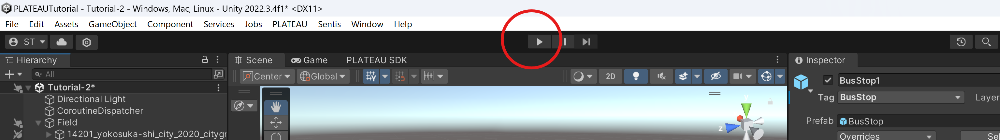

# PLATEAU チュートリアル <br> 避難所配置の最適化シミュレーション 実装ガイド

# 目次
- [PLATEAU チュートリアル  避難所配置の最適化シミュレーション 実装ガイド](#plateau-チュートリアル--避難所配置の最適化シミュレーション-実装ガイド)
- [目次](#目次)
- [目的](#目的)
- [作成環境](#作成環境)
- [事前準備](#事前準備)
  - [Unityのインストール](#unityのインストール)
  - [ML-Agentsのプロジェクトへの導入](#ml-agentsのプロジェクトへの導入)
  - [NewtonSoft.jsonのプロジェクトへの導入](#newtonsoftjsonのプロジェクトへの導入)
- [実装手順](#実装手順)
  - [1.モデル都市のインポート](#1モデル都市のインポート)
  - [2. 必要素材の準備](#2-必要素材の準備)
    - [2-1. 避難者のプレハブの作成](#2-1-避難者のプレハブの作成)
    - [2-2. マテリアルの作成](#2-2-マテリアルの作成)
  - [3. 避難所の候補地の事前設定](#3-避難所の候補地の事前設定)
  - [4. 避難者が移動する経路を作る（tranへのナビゲーションメッシュの適用）](#4-避難者が移動する経路を作るtranへのナビゲーションメッシュの適用)
  - [5. プログラムファイルの作成](#5-プログラムファイルの作成)
  - [6. シミュレーション環境パラメータの設定](#6-シミュレーション環境パラメータの設定)
    - [6-1. `ShelterManagementAgent`の設定](#6-1-sheltermanagementagentの設定)
    - [6-2. `EnvManager`の設定](#6-2-envmanagerの設定)
    - [6-3. `Evacuee`の設定](#6-3-evacueeの設定)
    - [6-4. ハイパーパラメータの設定](#6-4-ハイパーパラメータの設定)
  - [7. 学習の実行と結果の確認](#7-学習の実行と結果の確認)
    - [7-1. 学習の実行](#7-1-学習の実行)
    - [7-2. 学習結果の分析](#7-2-学習結果の分析)
    - [7-3. 学習済みモデルを使用してシミュレーションを動かす](#7-3-学習済みモデルを使用してシミュレーションを動かす)


# 目的
津波や洪水等の災害発生時において、最適な避難所の配置計画を作成することを目指します。避難時間や避難率の最適化を目標に、AIに都市モデル内でどの建物を避難所にすべきかを学習させ、動的に変化する避難者の配置分布から最適な避難所配置を導きます。

# 作成環境
- Unity 2023.2.19f1
- ML-Agents toolkit Release 22
- PLATEAU SDK for Unity 2.3.2
- Windows 11

# 事前準備
## Unityのインストール
Unityアカウントを作成し、Unity Hubをインストールします。
[Unity Hub](https://unity.com/ja/download)のダウンロードページを開き、お使いのOSに合わせたバージョンをインストールしてください。

Unity Hubインストール後、Unity Hubを起動し、`インストール`タブから`Unity 2023.2.19f1`をインストールします。


インストールが完了したら、`プロジェクト`タブから`新規`を選択し、`Unity 2023.2.19f1`を選択してプロジェクトを作成します。

## ML-Agentsのプロジェクトへの導入
Unityのプロジェクトを作成したら、ML-Agentsをインストールします。
インストールガイドは[こちら](https://github.com/Unity-Technologies/ml-agents/blob/release_22/docs/Installation.md)

<details>
<summary>Unityパッケージの導入</summary>

1. [リリースページ](https://github.com/Unity-Technologies/ml-agents/releases/tag/release_22)にアクセスし、`Source code(zip)`をダウンロードし、展開してください。

2. 作成したUnityプロジェクトを開き、メニューバーの`Window > PackageManager`を開き、上部 ＋ボタンから`Add packages from disk`を選択します。

    

3. エクスプローラーが開くので、展開後フォルダの以下のファイルをそれぞれ選択してください。
    ```
    com.unity.ml-agents/package.json"
    com.unity.ml-agents.extensions/package.json
    ```
</details>

<details>
<summary>Python環境の構築</summary>

ML-Agentsでモデル訓練を実行するには、Pythonパッケージの導入が必要です。
Python環境並びにパッケージのインストール方法については、お使いの環境に合わせて適宜読み替えてください。ここでは、標準のパッケージインストールツール`pip`を使用した場合のインストール方法について解説します。

1. `mlagents`のインストール
```shell
pip install mlagents==1.1.0
```
<details>
<summary>GPUを使用した学習/推論を行いたい場合</summary>

NVIDIAのGPUをお持ちの方は、モデル訓練時にGPUを使用することが可能です。これは多くの場合、CPUよりも学習時間が早くなります。

GPU を使用した学習にはCUDAと対応するPytorchのインストールが必要です。

1. CUDA版PyTorchのインストール
    ```shell
    pip install torch==2.1.1 torchvision==0.16.1 torchaudio==2.1.1 --index-url https://download.pytorch.org/whl/cu118
    ```
2. CUDA Ver 11.8のインストール
    下記URLにアクセスし、インストーラー経由でインストールします。
    ```
    https://developer.nvidia.com/cuda-11-8-0-download-archive
    ```
</details>

</details>

## NewtonSoft.jsonのプロジェクトへの導入
PLATEAUの属性情報をUnityスクリプトで利用可能にするため、JSONシリアライザー/デシリアライザーツールである Newtonsoft.json の導入を行います。

メニューバーの`Window > PackageManager`を開き、上部 ＋ボタンから`Add packages from git URL`を選択し下記のURLを入力してインストールします。
```
https://github.com/jilleJr/Newtonsoft.Json-for-Unity.git
```


# 実装手順

## 1.モデル都市のインポート
PLATEAU SDKより、使用したい都市モデルをインポートします。

※今回は題材として、横須賀市市役所周辺のモデルをインポートします。


インポート後、全体制御用のGameObjectを作成します。名前は任意ですが、今回は`Field`としておきます。


## 2. 必要素材の準備
### 2-1. 避難者のプレハブの作成
1. オブジェクトのインポート

    今回はAssetStore上にある、無料のキャラクターオブジェクトを利用します。
    - [Easy Primitive People](https://assetstore.unity.com/packages/3d/characters/easy-primitive-people-161846)

    AssetStoreからインポートし、プロジェクトに適用します。
    どのキャラクターでも構いませんが、今回使用するキャラクターは分かりやすいようにAssetフォルダ直下に配置し、名前を`Evacuee`としておきます。

2. 必要コンポーネントの追加
    `Evacuee`オブジェクトを選択し、以下のコンポーネントを追加します。
    - `Nav Mesh Agent` : キャラクターの移動を制御するコンポーネント
    - `Rigidbody` : 物理演算を適用を提供するコンポーネント
    - `Capsule Collider` : キャラクターの当たり判定を提供するコンポーネント

    

### 2-2. マテリアルの作成
AIが避難所に指定した建物とそうでない建物を視覚的に区別するために、2色のマテリアルを作成しておきます。

色は任意ですが、今回は以下のような構成で作成します。
| 色       | 意味       |
|-----------|-----------|
| 緑  | 避難所に選定された建物   | 
| 黒   | 避難所に選定されなかった建物   |


## 3. 避難所の候補地の事前設定
AIがシミュレーション中に避難所として指定できる建物の候補地を事前に設定します。
下記手順を候補地の分だけ繰り返して設定していきます。

1. 避難所かそうでないかを判別するためのタグを追加します。

    任意のオブジェクトを選択し、Inspectorの上部にある`Tag > Add Tag`を選択します。
    `+`ボタンを押下し、新しいタグ名`Shelter`を追加します。

    

2. 候補地とする建物（`bldg_<オブジェクトID>`）を選択し、Inspectorから先ほど追加したタグ名`Shelter`を設定します。
    

3. 必要な以下のコンポーネントを建物に追加,設定します。
    建物オブジェクトを選択した状態で、Inspector下部にある`Add Component`を押下し、以下のコンポーネントを追加してください。
    - `NavMeshObstacle` : 後述する`ナビゲーションメッシュの適用`際に必要です。追加した後は、チェックマークを外し、ディアクティベーションしてください。

    次に、避難者が建物に到着したことを検知するために、当たり判定を設定します。`MeshCollider`にある,以下の項目にチェックを入れてください。
    - `Convex`
      - `Is Trigger`
    
    

4. 建物の入り口と道路を繋ぐためにPlaneオブジェクトを追加します。
    このオブジェクトの名前を`SubTran`とし、建物と道路を繋ぐように配置してください。
    

5. 建物のゲーム内での座標位置情報を扱うため、建物の子要素に目印となるcubeオブジェクトを追加します。

    このとき、cubeオブジェクトは、`手順4`で追加したPlaneオブジェクト上で、建物の内側の位置に配置してください。

    > デフォルトでは建物（`bldg`）の座標情報は*(X,Y,Z) = (0,0,0)*で固定されています。AIへ渡す観測情報として、建物の座標情報を取得するために、代替としてcubeオブジェクトを追加しています。
    
    


## 4. 避難者が移動する経路を作る（tranへのナビゲーションメッシュの適用）

1. ナビゲーションメッシュを適用する前に、除外範囲を設定します。
    このままでは、フィールドの地形や他の建物上にもナビゲーションメッシュが適用されてしまい、避難者が通行可能になっていまうため、事前にこれらの除外設定を行います。

    - 地形オブジェクト`dem_<オブジェクトID>`を除外設定に追加する。
  
        Hierarchyの検索ボックスに`dem`と入力し、地形オブジェクトを選択します。`Add Component`から`NavMesh Obstacle`コンポーネントを追加し、チェックマークを外してディアクティベーションします。
        

    - 建物オブジェクト`bldg_<オブジェクトID>`を除外設定に追加する。
  
        Hierarchyの検索ボックスに`bldg`と入力し、建物オブジェクトを選択します。`Add Component`から`NavMesh Obstacle`コンポーネントを追加し、チェックマークを外してディアクティベーションします。
        

2. 避難者が移動する経路を作成するために、都市モデル内の道路データに、ナビゲーションメッシュを適用します。
    > ナビゲーションメッシュとは
    > NPCの移動可能領域を設定するUnityの機能です。ナビゲーションメッシュを適用することで、NPCが移動可能な範囲を設定し、移動経路を計算することができます。

    Hirarchyビューから、都市モデル内の道路データ`tran`と建物の入り口と道路を繋ぐ`SubTran`を検索し、`Add Component`から`NavMesh Surface`を選択します。

    

    > このとき、`tran_<オブジェクトID>`と書かれているオブジェクトを選択すると、オブジェクト１つ１つにナビゲーションメッシュを適用することができますが、個数が膨大なため非常に時間がかかります。道路全体に適用する場合は、親オブジェクトである`tran`を選択し、ナビゲーションメッシュを適用してください。

    `NavMesh Surface`コンポーネントを追加したら、`Bake`ボタンを押下し、ナビゲーションメッシュを生成・適用します。

    

## 5. プログラムファイルの作成
ここからは、C# 用いて、AIやシミュレーションの挙動を制御するスクリプトファイルを作成します。

以下の各プログラムを作成し、各オブジェクトへアタッチしていきます。

<details>
<summary>避難者用プログラムの作成</summary>

- `Evacuee.cs` 
    ```cs
    using System.Collections;
    using System.Collections.Generic;
    using UnityEngine;
    using UnityEngine.AI;

    /// <summary>
    /// 避難者の制御を行うクラス
    /// </summary>
    public class Evacuee : MonoBehaviour {
        
        [Header("Movement Target")]
        public GameObject Target;
        private NavMeshAgent NavAgent;
        private EnvManager _env;
        private bool isEvacuating = false; // 避難処理中のフラグ。当たり判定により発火するため、複数回避難処理が行われるのを防ぐためのフラグ
        private List<string> excludeTowers; //1度避難したタワーのUUIDを格納するリスト
        void Awake() {
            NavAgent = GetComponent<NavMeshAgent>();    
            excludeTowers = new List<string>(); //初期化

            _env = GetComponentInParent<EnvManager>();
            _env.Agent.OnDidActioned += () => {
                Debug.Log("OnDidActioned");
                // 最短距離の避難所を探す
                if(this != null && this.gameObject.activeSelf) {
                    List<GameObject> towers = SearchTowers();
                    if(towers.Count > 0) {
                        Target = towers[0]; //最短距離のタワーを目標に設定
                        NavAgent.SetDestination(Target.transform.position);
                    }
                }
            };
        }


        
        /// <summary>
        /// タグ名から避難所を検索する。フィールドに存在する全てのタワーを検索し、距離別にソートして返す
        /// </summary>
        /// <param name="excludeTowerUUIDs">除外するタワーのUUID.未指定の場合はnull</param>
        /// <returns>localField内のTowerオブジェクトのリスト</returns>
        private List<GameObject> SearchTowers(List<string> excludeTowerUUIDs = null) {
            GameObject[] towers = GameObject.FindGameObjectsWithTag("Shelter");
            List<GameObject> sortedTowerPoints = new List<GameObject>();
            foreach (var tower in towers) {
                if(excludeTowerUUIDs != null && excludeTowerUUIDs.Contains(tower.GetComponent<Tower>().uuid)) {
                    continue;
                }
                GameObject point = tower.transform.GetChild(0).gameObject;
                sortedTowerPoints.Add(point);
            }
            // NOTE: エピソード更新時にgameObjectがnullになることがあるので、nullチェックを行う
            if(this != null) {
                sortedTowerPoints.Sort((a, b) => Vector3.Distance(a.transform.position, transform.position).CompareTo(Vector3.Distance(b.transform.position, transform.position))); 
            }
            return sortedTowerPoints;
        }

        /// <summary>
        /// 避難を行う
        /// </summary>
        public void Evacuation(Tower tower) {
            if(isEvacuating) {
                return;
            }
            isEvacuating = true;
            if(tower.currentCapacity > 0) {
                tower.NowAccCount++;
                gameObject.SetActive(false);
            } else { //キャパシティがいっぱいの場合、次のタワーを探す
                excludeTowers.Add(tower.uuid);
                List<GameObject> towers = SearchTowers(excludeTowers);
                Debug.Log("TowersCount" + towers.Count);
                if(towers.Count > 0) {
                    Target = towers[0]; //最短距離のタワーを目標に設定
                    NavAgent.SetDestination(Target.transform.position);
                }
            }
            isEvacuating = false;
        }

    }
    ```
    作成後、Assetsフォルダ内にある`Evacuee`オブジェクトにアタッチしてください。
</details>


<details>
<summary> 避難所建物用プログラムの作成 </summary>

- `Shelter.cs`
  ```cs
  using System.Collections;
    using System.Collections.Generic;
    using UnityEngine;

    /// <summary>
    /// 避難所に関するスクリプト（オブジェクト１台分）
    /// 現在の収容人数や、受け入れ可否等のデータを用意
    /// </summary>
    public class Tower : MonoBehaviour{
        public int MaxCapacity = 10; //最大収容人数
        public int NowAccCount = 0; //現在の収容人数
        public int currentCapacity; //現在の受け入れ可能人数：最大収容人数 - 現在の収容人数

        public string uuid; //タワーの識別子

        private string LogPrefix = "Tower: ";

        /**Events */
        public delegate void AcceptRejected(int NowAccCount) ; //収容定員が超過した時に発火する
        public AcceptRejected onRejected;

        private EnvManager _env;

        void Start() {
            _env = GetComponentInParent<EnvManager>();
            _env.OnEndEpisode += (float _) => {
                NowAccCount = 0;
            };
        }

        void Update() {
            currentCapacity = MaxCapacity - NowAccCount;
            if (currentCapacity <= 0) {
                onRejected?.Invoke(NowAccCount);
            }
        }

        void OnTriggerEnter(Collider other) {
            
            bool isEvacuee = other.CompareTag("Evacuee");
            if (isEvacuee) {
                Evacuee evacuee = other.GetComponent<Evacuee>();
                evacuee.Evacuation(this);
            }
            
            
        }
    }

  ```
  作成後、シーン内に設定した各避難所の建物オブジェクトにアタッチしてください。
</details>

<details>
<summary>AI用プログラムの作成</summary>

- `ShelterAgent.cs`
  ```cs
    using System.Collections;
    using System.Collections.Generic;
    using System;
    using System.Linq;
    using UnityEngine;
    using Unity.MLAgents;
    using Unity.MLAgents.Actuators;
    using Unity.MLAgents.Sensors;

    public class ShelterManagementAgent : Agent {
        
        public GameObject[] ShelterCandidates; //エージェントが操作する避難所の候補リスト
        public Material SelectedMaterial;
        public Material NonSelectMaterial;
        public Action OnDidActioned;
        public List<Tuple<int, int, List<bool>>> ActionLogs = new List<Tuple<int, int, List<bool>>>(); // episode, step, 各避難所候補の選択状況のリスト(true or false)
        private EnvManager _env;
        EnvironmentParameters m_ResetParams;


        void Start() {
            _env = GetComponentInParent<EnvManager>();
            //Academy.Instance.AutomaticSteppingEnabled = true;

        }

        public override void Initialize() {
            Time.timeScale = 100f;
            m_ResetParams = Academy.Instance.EnvironmentParameters;
            if(ShelterCandidates.Length == 0) {
                //Debug.LogError("No shelter candidates");
                // NOTE: 予め候補地は事前に設定させておくこと
                ShelterCandidates = GameObject.FindGameObjectsWithTag("Shelter");
            }
        }

        /// <summary>
        /// Agent.EndEpisode()後に呼ばれる
        /// </summary>
        public override void OnEpisodeBegin() {
            _env.OnEpisodeBegin();
            Debug.Log("Episode begin");
            RequestDecision();
        }

        public void OnEndEpisode() {
            // データの保存とActionLogsの初期化
            string[] shelterIds = new string[ShelterCandidates.Length];
            for(int i = 0; i < ShelterCandidates.Length; i++) {
                shelterIds[i] = ShelterCandidates[i].name;
            }
            string[] headers = new string[ShelterCandidates.Length + 2];
            headers[0] = "Episode";
            headers[1] = "Step";
            Array.Copy(shelterIds, 0, headers, 2, shelterIds.Length);
            Utils.SaveResultCSV(
                headers,
                ActionLogs,
                (data) => new string[] { data.Item1.ToString(), data.Item2.ToString() }.Concat(data.Item3.ConvertAll(x => x ? "1" : "0")).ToArray(),
                $"{_env.recordID}/ActionLog_Episode_{_env.currentEpisodeId}.csv"
            );
            ActionLogs.Clear();
        }

        /// <summary>
        /// 1. 各避難所候補地の位置情報
        /// 2. 各候補地が収容できる避難者の数。
        /// 3. 避難者の現在位置 
        /// </summary>
        /// <param name="sensor"></param>
        public override void CollectObservations(VectorSensor sensor) {

            foreach(GameObject shelter in ShelterCandidates) {
                //Debug.Log("ShelterPos?" + shelter.transform.GetChild(0).gameObject.transform.position);
                sensor.AddObservation(shelter.transform.GetChild(0).gameObject.transform.position);
                sensor.AddObservation(shelter.GetComponent<Shelter>().currentCapacity);
            }
            // 観測のタイミングで避難者が避難してGameObjectが消えることがあるので、ここでコピーを作成
            List<GameObject> evacuees = new List<GameObject>(_env.Evacuees);
            sensor.AddObservation(evacuees.Count);

            // 避難者の位置情報を追加
            foreach(GameObject evacuee in evacuees) {
                if(evacuee != null) {
                    sensor.AddObservation(evacuee.transform.position);
                } else {
                    sensor.AddObservation(Vector3.zero);
                }
            }
            

        }

        public override void OnActionReceived(ActionBuffers actions) {
            var Selects = actions.DiscreteActions; //エージェントの選択。環境の候補地配列と同じ順序
            List<bool> selectList = new List<bool>();
            if(Selects.Length != ShelterCandidates.Length) {
                Debug.LogError("Invalid action size : 避難所候補地のサイズとエージェントの選択サイズが不一致です");
                return;
            }

            for(int i = 0; i < Selects.Length; i++) {
                int select = Selects[i]; // 0:非選択、1:選択
                GameObject Shelter = ShelterCandidates[i];
                if(select == 1) {
                    _env.CurrentShelters.Add(Shelter);
                    Shelter.tag = "Shelter";
                    Shelter.GetComponent<MeshRenderer>().material = SelectedMaterial;
                    selectList.Add(true);
                } else if(select == 0) {
                    _env.CurrentShelters.Remove(Shelter);
                    Shelter.tag = "Untagged";
                    Shelter.GetComponent<MeshRenderer>().material = NonSelectMaterial;
                    selectList.Add(false);
                } else {
                    Debug.LogError("Invalid action");
                }
            }

            // 行動ログを記録（episode, step, 各避難所候補の選択状況のリスト(true or false)）
            ActionLogs.Add(new Tuple<int, int, List<bool>>(_env.currentEpisodeId, _env.currentStep, selectList));
            

            OnDidActioned?.Invoke();
        }

        /// <summary>
        ///  ランダムに建物を選択
        /// </summary>
        public override void Heuristic(in ActionBuffers actionsOut) {
            var Selects = actionsOut.DiscreteActions;
            for(int i = 0; i < Selects.Length; i++) {
                Selects[i] = UnityEngine.Random.Range(0, 2);
            }
        }


    }


  ```
  シーン内の`ShelterManagementAgent`オブジェクトにアタッチしてください。

</details>


<details>
<summary>PLATEAU属性情報のJSONデータをデシリアライズするための型定義の作成</summary>

- `CityObjectTypes.cs`
    ```cs
    using System.Collections.Generic;
    using Newtonsoft.Json;
    using Newtonsoft.Json.Linq;

    public class AttributeValue
    {
        public string Key { get; set; }
        public string Type { get; set; }

        private object value;

        [JsonProperty("value")]
        public object Value
        {
            get => Type == "AttributeSet" ? AttributeSetValue : value;
            set
            {
                if (Type == "AttributeSet" && value is JArray jArray)
                {
                    // JSON配列をList<AttributeValue>に変換
                    AttributeSetValue = jArray.ToObject<List<AttributeValue>>();
                }
                else
                {
                    this.value = value;
                }
            }
        }

        // "type": "AttributeSet"の場合にデシリアライズされるプロパティ
        [JsonIgnore] // このプロパティはJSONに含めない
        public List<AttributeValue> AttributeSetValue { get; private set; }
    }

    public class RootObject
    {
        public string GmlID { get; set; }
        public List<int> CityObjectIndex { get; set; }
        public string CityObjectType { get; set; }
        public List<AttributeValue> Attributes { get; set; }
    }

    ```
    後述の`シミュレーション環境制御プログラムの作成`で建物オブジェクトの属性情報取得で使用します。
</details>

<details>
<summary>シミュレーション環境制御プログラムの作成</summary>

- `Utils.cs`
    ```cs
    using System;
    using System.IO;
    using System.Collections;
    using System.Collections.Generic;
    using UnityEngine;
    public class Utils : MonoBehaviour {
        
        /// <summary>
        /// 避難者のランダムスポーン範囲を描画する
        /// </summary>
        public static void DrawWireCircle(Vector3 center, float radius, int segments = 36) {
            float angle = 0f;
            float angleStep = 360f / segments;

            Vector3 prevPoint = center + new Vector3(radius, 0, 0); // 初期点

            for (int i = 1; i <= segments; i++) {
                angle += angleStep;
                float rad = Mathf.Deg2Rad * angle;

                Vector3 newPoint = center + new Vector3(Mathf.Cos(rad) * radius, 0, Mathf.Sin(rad) * radius);
                Gizmos.DrawLine(prevPoint, newPoint);

                prevPoint = newPoint; // 次の線を描画するために現在の点を更新
            }
        }


        /// <summary> 汎用的なCSV保存関数 </summary>
        public static void SaveResultCSV<T>(string[] header, List<T> dataList, Func<T, string[]> convertToCSVRow, string filePath = null, bool append = true) {

            if (filePath == null) {
                filePath = "result.csv";
            }
            // パスの先頭に指定パスを付与
            filePath = Path.Combine(Application.dataPath, filePath);
            // フォルダが存在しない場合は作成
            string dir = Path.GetDirectoryName(filePath);
            if (!Directory.Exists(dir)) {
                Directory.CreateDirectory(dir);
            }

            bool writeHeader = !File.Exists(filePath) || !append;
            using (StreamWriter writer = new StreamWriter(filePath, append)) {
                if (writeHeader) writer.WriteLine(string.Join(",", header));

                foreach (T data in dataList) {
                    string[] row = convertToCSVRow(data);
                    writer.WriteLine(string.Join(",", row));
                }
            }
            Debug.Log($"CSV saved: {filePath}");
        }

    }
    ```

- `ShelterEnvManager.cs`
    ```cs
    using System;
    using System.Collections;
    using System.Collections.Generic;
    using UnityEngine;
    using UnityEngine.AI;
    using TMPro;
    using PLATEAU.CityInfo;
    using PLATEAU.Util;
    using Newtonsoft.Json;

    /// <summary>
    /// シミュレータ環境全般の制御を行うクラス
    /// </summary>
    public class EnvManager : MonoBehaviour {
        /**シミュレーションモードの選択を定義*/
        public enum SimulateMode {
            Train, // モデル訓練
            Inference // モデル推論
        }

        public enum SpawnMode {
            Random, // 一定の範囲内でランダムに出現
            Custom, // 自身でスポーン位置・範囲を設定
        }

        [Header("Environment Settings")]
        public SimulateMode Mode = SimulateMode.Train; 
        public SpawnMode EvacSpawnMode = SpawnMode.Random; 
        public float TimeScale = 1.0f; // 推論時のシミュレーションの時間スケール
        public bool IsRecordData = false;
        /// <summary>
        /// 生成する避難者の人数に合わせて避難所の収容人数をスケーリングします.
        /// </summary>
        /// <example>
        /// スケーリング例:
        /// <list type="bullet">
        /// <item>
        /// <description>1.0f: 通常 → 収容人数算出式に合わせて避難所の収容人数を設定</description>
        /// </item>
        /// <item>
        /// <description>0.5f: 避難者の人数が半分 → 避難所の収容人数も半分</description>
        /// </item>
        /// </list>
        /// </example>
        public float AccSimulateScale = 1.0f; 
        public float MaxSeconds = 60.0f; // シミュレーションの最大時間（秒）
        public int SpawnEvacueeSize;
        public GameObject SpawnEvacueePref; // 避難者のプレハブ
        public float SpawnRadius = 10f; // スポーンエリアの半径
        public Vector3 spawnCenter = Vector3.zero; // スポーンエリアの中心位置

        public GameObject AgentObj;
        public ShelterManagementAgent Agent;

        [Header("Objects")]
        [System.NonSerialized]
        public List<GameObject> Evacuees; // 避難者のリスト
        [System.NonSerialized]
        public List<GameObject> CurrentShelters; // 現在のアクティブな避難所のリスト
        public List<GameObject> Shelters; // 全避難所のリスト

        [Header("UI Elements")]
        public TextMeshProUGUI stepCounter;
        public TextMeshProUGUI evacRateCounter;

        // Event Listeners
        public delegate void EndEpisodeHandler(float evacueeRate);
        public EndEpisodeHandler OnEndEpisode;
        public delegate void StartEpisodeHandler();
        public StartEpisodeHandler OnStartEpisode;
        [Header("Parameters")]
        public float EvacuationRate; // 全体の避難率
        public bool EnableEnv = false; // 環境の準備が完了したか否か（利用不可の場合はfalse）
        public int currentStep;
        private float currentTimeSec;
        private List<Tuple<float, float>> evaRatePerSec = new List<Tuple<float, float>>();
        public int currentEpisodeId = 0;
        public string recordID;
        void Start() {
            if(Mode == SimulateMode.Inference) {
                Time.timeScale = TimeScale; // 推論時のみシミュレーションの時間スケールを設定
            }

            if(AccSimulateScale > 1.0f) {
                Debug.LogError("AccSimulateScale is greater than 1.0f. Please set the value between 0.0f and 1.0f.");
            }
            // 日付-時間-分-秒を組み合わせた記録用IDを生成
            recordID = System.DateTime.Now.ToString("yyyy_MM_dd-HH_mm_ss");

            NavMesh.pathfindingIterationsPerFrame = 1000000; // パス検索の上限値を設定

            Agent = AgentObj.GetComponent<ShelterManagementAgent>();
            Evacuees = new List<GameObject>(); // 避難者のリストを初期化
            CurrentShelters = new List<GameObject>(); // 避難所のリストを初期化
            Shelters = new List<GameObject>(); // 避難所のリストを初期化
            currentStep = Agent.StepCount;

            // 避難所登録
            Shelters = new List<GameObject>(GameObject.FindGameObjectsWithTag("Shelter"));
            // 固定値の避難所を追加
            GameObject[] constSheleters = GameObject.FindGameObjectsWithTag("ConstShelter");
            foreach (var shelter in constSheleters) {
                Shelters.Add(shelter);
            }
            // コンポーネントの初期化
            foreach (var shelter in Shelters) {
                if(shelter.GetComponent<Shelter>() == null) {
                    Shelter tower = shelter.AddComponent<Shelter>();
                    tower.uuid = System.Guid.NewGuid().ToString();
                    tower.MaxCapacity = GetAccSize(shelter);
                    tower.NowAccCount = 0;
                }
            }

            /** エピソード終了時の処理*/
            OnEndEpisode += OnEndEpisodeHandler;
        }

        void OnDrawGizmos() {
            if(EvacSpawnMode == SpawnMode.Random) {
                Gizmos.color = Color.red;
                DrawWireCircle(spawnCenter, SpawnRadius);
            }
        }

        void FixedUpdate() {
            currentTimeSec += Time.deltaTime;
            EvacuationRate = GetCurrentEvacueeRate();
            evaRatePerSec.Add(new Tuple<float, float>(currentTimeSec, EvacuationRate));
            UpdateUI();
            if (currentTimeSec >= MaxSeconds || IsEvacuatedAll()) { // 制限時間 or 全避難者が避難完了した場合
                OnEndEpisode?.Invoke(EvacuationRate); // 制限時間を超えた場合、エピソード終了のイベントを発火
            }
        }

        private void OnEndEpisodeHandler(float evacuateRate) {
            // 1. 避難率による報酬
            float evacuationRateReward = GetCurrentEvacueeRate();

            // 2. 経過時間によりボーナスを与える
            float timeBonus = (MaxSeconds - currentTimeSec) / MaxSeconds;

            // 総合報酬
            float totalReward = evacuationRateReward + timeBonus;
            Debug.Log("Total Reward: " + totalReward);
            Agent.AddReward(totalReward);

            if(IsRecordData) {
                Utils.SaveResultCSV(
                    new string[] { "Time", "EvacuationRate" }, 
                    evaRatePerSec, 
                    (data) => new string[] { data.Item1.ToString(), data.Item2.ToString() },
                    $"{recordID}/EvaRatesPerSec_Episode_{currentEpisodeId}.csv"
                );
            }
            Agent.OnEndEpisode();

            Agent.EndEpisode();
            currentEpisodeId++;
        }

        /// <summary>
        /// エピソード開始時の初期化処理
        /// この関数はエージェントのイベント関数から参照されます 
        /// </summary>
        public void OnEpisodeBegin() {
            EnableEnv = false;
            Dispose();
            Create();
            OnStartEpisode?.Invoke();
            EnableEnv = true;
        }

        /// <summary>
        /// 環境をリセット,破棄をする関数。
        /// - 避難者のクリア
        /// - 避難所のクリア
        /// </summary>
        public void Dispose() {
            foreach (var evacuee in Evacuees) {
                Destroy(evacuee);
            }
            // 避難者スポーン地点の表示を非表示にする
            GameObject[] spawnPoints = GameObject.FindGameObjectsWithTag("SpawnPos");
            foreach (var spawnPoint in spawnPoints) {
                var point = spawnPoint.GetComponent<EvacueeSpawnPoint>();
                point.ShowRangeOff();
            }
            Evacuees = new List<GameObject>(); // 新しいリストを作成
            CurrentShelters = new List<GameObject>(); // 新しいリストを作成
            currentTimeSec = 0;
            evaRatePerSec.Clear();
        }

        /// <summary>
        /// 環境の生成を行う関数.
        /// - 避難者のスポーン 処理
        /// </summary>
        public void Create() {

            if(Mode == SimulateMode.Train) {
                if(EvacSpawnMode == SpawnMode.Custom) {
                    // Custom Spawnエリアの中からランダムに1つ選択し、避難者をスポーンさせ、避難者位置に分布を持たせる
                    GameObject[] spawnPoints = GameObject.FindGameObjectsWithTag("SpawnPos");
                    GameObject selectSpawnPoint = spawnPoints[UnityEngine.Random.Range(0, spawnPoints.Length)];
                    var point = selectSpawnPoint.GetComponent<EvacueeSpawnPoint>();
                    point.ShowRangeOn();
                    float radius = point.SpawnRadius;
                    Vector3 spawnCenter = selectSpawnPoint.transform.position;
                    Vector3 spawnPos = GetRandomPositionOnNavMesh(radius, spawnCenter);
                    for (int i = 0; i < SpawnEvacueeSize; i++) {
                        SpawnEvacuee(spawnPos);
                    }
                } else {
                    for (int i = 0; i < SpawnEvacueeSize; i++) {
                        Vector3 spawnPos = GetRandomPositionOnNavMesh(SpawnRadius, spawnCenter);
                        if (spawnPos != Vector3.zero) {
                            SpawnEvacuee(spawnPos);
                        }
                    }
                }
                

            } else if(Mode == SimulateMode.Inference) {
                if(EvacSpawnMode == SpawnMode.Custom) {
                    GameObject[] spawnPoints = GameObject.FindGameObjectsWithTag("SpawnPos");
                    foreach (var spawnPoint in spawnPoints) {
                        var point = spawnPoint.GetComponent<EvacueeSpawnPoint>();
                        float radius = point.SpawnRadius;
                        Vector3 spawnCenter = spawnPoint.transform.position;
                        Vector3 spawnPos = GetRandomPositionOnNavMesh(radius, spawnCenter);
                        for (int i = 0; i < point.SpawnSize; i++) {
                            SpawnEvacuee(spawnPos);
                        }
                    }
                } else {
                    for (int i = 0; i < SpawnEvacueeSize; i++) {
                        Vector3 spawnPos = GetRandomPositionOnNavMesh(SpawnRadius, spawnCenter);
                        if (spawnPos != Vector3.zero) {
                            SpawnEvacuee(spawnPos);
                        }
                    }
                }
            }
        }

        /// <summary>
        /// 避難者１体を生成、登録する関数
        /// </summary>
        /// <param name="spawnPos"></param>
        private void SpawnEvacuee(Vector3 spawnPos) {
            GameObject evacuee = Instantiate(SpawnEvacueePref, spawnPos, Quaternion.identity, transform);
            evacuee.tag = "Evacuee";
            Evacuees.Add(evacuee);
        }

        /// <summary>
        /// 範囲内のナビメッシュ上の任意の座標を取得する。
        /// </summary>
        /// <returns>ランダムなナビメッシュ上の座標 or Vector3.zero</returns>
        private static Vector3 GetRandomPositionOnNavMesh(float radius, Vector3 center) {
            Vector3 randomDirection = UnityEngine.Random.insideUnitSphere * radius; // 半径内のランダムな位置を取得
            randomDirection += center; // 中心位置を加算
            NavMeshHit hit;
            if (NavMesh.SamplePosition(randomDirection, out hit, radius, NavMesh.AllAreas)) {
                return hit.position;
            }
            return Vector3.zero; // ナビメッシュが見つからなかった場合
        }

        private void UpdateUI() {
            stepCounter.text = $"Remain Seconds : {MaxSeconds - currentTimeSec:F2}";
            evacRateCounter.text = $"Evacuation Rate : {EvacuationRate:F2}";
        }

        /// <summary>
        /// 現在の避難完了率を取得する
        /// </summary>
        /// <returns>現在の避難完了率: 0～1</returns>
        private float GetCurrentEvacueeRate() {
            int evacueeSize = Evacuees.Count;
            int evacuatedSize = 0;
            foreach (var evacuee in Evacuees) {
                if (!evacuee.activeSelf) {
                    evacuatedSize++;
                }
            }
            return (float)evacuatedSize / evacueeSize;
        }


        /// <summary>
        /// 避難者のランダムスポーン範囲を描画する
        /// </summary>
        private static void DrawWireCircle(Vector3 center, float radius, int segments = 36) {
            float angle = 0f;
            float angleStep = 360f / segments;

            Vector3 prevPoint = center + new Vector3(radius, 0, 0); // 初期点

            for (int i = 1; i <= segments; i++) {
                angle += angleStep;
                float rad = Mathf.Deg2Rad * angle;

                Vector3 newPoint = center + new Vector3(Mathf.Cos(rad) * radius, 5, Mathf.Sin(rad) * radius);
                Gizmos.DrawLine(prevPoint, newPoint);

                prevPoint = newPoint; // 次の線を描画するために現在の点を更新
            }
        }


        /// <summary>
        /// 属性情報から避難所の収容人数を取得する
        /// 【計算式】
        /// 収容可能人数＝ 床総面積㎡×0.8÷1.65㎡
        /// ※出典：https://manboukama.ldblog.jp/archives/50540532.html
        /// </summary>
        /// <param name="shelterBldg">避難所のGameObject</param>
        /// <returns>避難所の収容人数(設定パラメータによりスケーリングされます)</returns>
        private int GetAccSize(GameObject shelterBldg) {
            double? totalFloorSize = null;
            // PLATEAU City Objectから、建物の高さを取得し、避難所の収容人数を動的に設定する
            var cityObjectGroup = shelterBldg.GetComponent<PLATEAUCityObjectGroup>();
            var rootCityObject = cityObjectGroup.CityObjects.rootCityObjects[0];

            // Newtonsoft.Jsonを使用して、CityObjectの属性情報クラスにデシリアライズして取得
            var cityObjectJsonStr = JsonConvert.SerializeObject(rootCityObject);
            var attributes = JsonConvert.DeserializeObject<RootObject>(cityObjectJsonStr).Attributes;
            // 属性値リストを巡回し、床総面積から収容人数を算出
            foreach(var attribute in attributes) {
                if(attribute.Key == "uro:buildingDetailAttribute") {
                    foreach(var uroAttr in attribute.AttributeSetValue) { 
                        if(uroAttr.Key == "uro:totalFloorArea") {
                            if(double.TryParse(uroAttr.Value.ToString(), out double parsedValue)) {
                                totalFloorSize = parsedValue;
                            }
                        }
                    }
                }
            }

            // 結果が取得できなかった場合は0を返す
            if(totalFloorSize == null) {
                Debug.LogError("Failed to get the total floor size of the shelter building.");
                return 0;
            } else {
                // 収容可能人数＝総面積×0.8÷1.65㎡とする
                return (int)((totalFloorSize * 0.8 / 1.65) * AccSimulateScale);
            }
        }


        private bool IsEvacuatedAll() {
            foreach (var evacuee in Evacuees) {
                if (evacuee.activeSelf) {
                    return false;
                }
            }
            return true;
        }
    }

    ```
    作成後シーン内の`Field`オブジェクトにアタッチしてください。
</details>


## 6. シミュレーション環境パラメータの設定

### 6-1. `ShelterManagementAgent`の設定
AIの挙動を制御する`ShelterManagementAgent`の設定を行います。Inspectorから`Behavior Parameters`の以下項目を設定します。
- `Behavior Parameters`
```
Actions
    Continuous Actions : 0
    Discrete Branches : 9（避難所の数だけ）
        Branch 0 Size : 2 （二値分類の為）
        ...(以下候補地数分)
```


今回エピソード終了は、次の全体制御用プログラムで行っているため、`Max Steps`は`0`のままで設定してください。

### 6-2. `EnvManager`の設定
シミュレーション全体の条件を設定する`EnvManager`の設定を行います。Inspectorから以下の項目を設定します。
- `EnvManager`
```
<Environment Settings>
Mode               : Train / Inference （シミュレーションモード 訓練 / 推論 の選択）
Evac Spawn Mode    : Random / Custom （避難者の生成方法の指定 ランダム / カスタム の選択）
Acc Simulate Scale : 0.01 （避難所の収容人数のスケーリング係数。生成する避難者数に合わせて適宜調節） 
Max Seconds     : 120 （シミュレーションの最大時間（秒））
Spawn Evacuee Size : 50 （生成する避難者の数）// 数が多いと処理が重くなるため、適宜調整してください。
Spawn Radius : 10 （避難者のスポーンエリアの半径）// エディタ上に赤い円で表示されます
Spawn Center : (0,0,0) （避難者のスポーンエリアの中心位置）
Agent : ShelterManagementAgent （エージェントのオブジェクト）
```


### 6-3. `Evacuee`の設定
避難者の挙動を制御する`Evacuee`の設定を行います。Assets内から`Evacuee`オブジェクトを選択し、Inspectorから以下の項目を設定します。設定値は任意です。
- `NavMesh Agent`
```
<Steering>
Speed : 3.5 （避難者の移動速度 m/s）
Angular Speed : 120 （避難者の回転速度）
```


### 6-4. ハイパーパラメータの設定
プロジェクト内の任意の場所に、ニューラルネットワークのハイパーパラメータの値を記載する
yamlファイルを作成します。

```yaml
behaviors:
  ShelterSelect:
    trainer_type: ppo # 使用するトレーナーの種類（ここではProximal Policy Optimization）
    hyperparameters:
      batch_size: 512 # 一度にトレーニングするサンプルの数
      buffer_size: 409600 # 経験バッファのサイズ
      learning_rate: 1e-3 # 学習率
      beta: 0.01 # エントロピー正則化の強さ
      epsilon: 0.3 # クリッピング範囲のパラメータ
      lambd: 0.99 # GAE（Generalized Advantage Estimation）のパラメータ
      num_epoch: 5 # 各バッチのトレーニングエポック数
      learning_rate_schedule: linear # 学習率のスケジュール（ここでは線形減衰）
    network_settings:
      normalize: false # 入力データの正規化を行うかどうか
      hidden_units: 512 # 各隠れ層のユニット数
      num_layers: 3 # 隠れ層の数
      vis_encode_type: simple # 視覚エンコーダのタイプ
    reward_signals:
      extrinsic:
        gamma: 0.80 # 割引率
        strength: 1.0 # 報酬信号の強さ
    keep_checkpoints: 5 # 保存するチェックポイントの数
    max_steps: 500000 # トレーニングの最大ステップ数
    time_horizon: 2048 # エージェントの時間的ホライゾン
    summary_freq: 5 # サマリーを記録する頻度
environment_parameters:
  mass:
    sampler_type: uniform # サンプラーの種類（ここでは一様分布）
    sampler_parameters:
      min_value: 0.5 # サンプルの最小値
      max_value: 10 # サンプルの最大値
  scale:
    sampler_type: uniform # サンプラーの種類（ここでは一様分布）
    sampler_parameters:
      min_value: 0.75 # サンプルの最小値
      max_value: 3 # サンプルの最大値

```
- 利用可能なパラメータの値については[公式ドキュメント](https://github.com/Unity-Technologies/ml-agents/blob/develop/docs/Training-Configuration-File.md)を参照してください。


## 7. 学習の実行と結果の確認

### 7-1. 学習の実行
本プロジェクトのルートディレクトリ上でターミナルを開き、以下のコマンドを実行します。
``` bash
mlagents-learn Assets/Config/Tutorial-1.yaml --run-id=ShelterAgent
```
準備が完了すると、以下のような表示になり待機状態になります。


この状態で、Unity Editor上の実行ボタンを押すと、学習が開始されます。



### 7-2. 学習結果の分析

学習が完了すると、`results`ディレクトリに学習した結果のニューラルネットワークモデルが保存されます。学習結果を確認するには、以下のコマンドを実行します。
``` bash
tensorboard --logdir=./results
```


### 7-3. 学習済みモデルを使用してシミュレーションを動かす
学習済みモデルを使用して、シミュレーションを動かす手順は以下の通りです。

1. エージェントにモデルを割り当てる
    学習済みモデルをAssetsフォルダにコピーし、シーン内の`BusAgent`を選択し`Behavior Parameters`の`Model`にコピーしたモデルを割り当てます。

    

2. シーンを実行する
    Unity Editor上で実行ボタンを押すと、学習済みモデルを使用してシミュレーションが動きます。

    

    エージェントはシミュレーション開始時に、都市内の避難者の分布や建物の収容人数を観測し、避難所の配置を決定します。その後、避難者が避難所に向かう様子を観察することができます。

3. シミュレーション結果を分析する。
    今回作成したAIモデルのシミュレーション結果の分析は、[「チュートリアル① モデル分析編」](https://github.com/Rikkyo-MiyayuLab/PLATEAU-Tutorial/tree/develop/docs/Tutorial-1-Inference)を参照してください。

