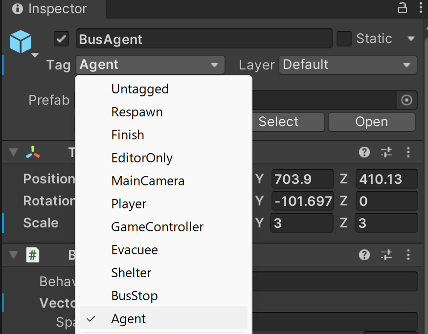
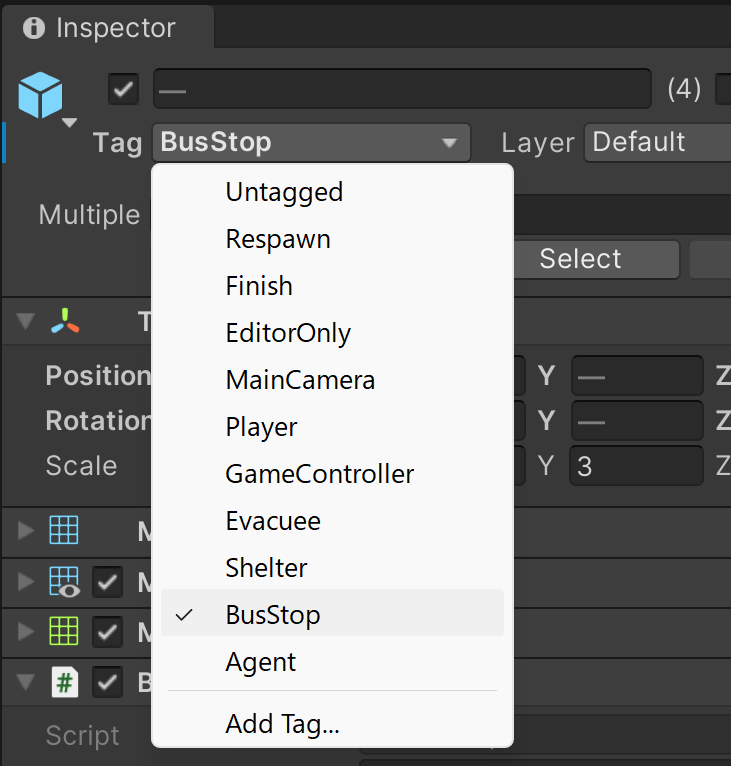

# PLATEAU チュートリアル <br> バス自動運行シミュレーション 実装ガイド

# 目次
- [PLATEAU チュートリアル  バス自動運行シミュレーション 実装ガイド](#plateau-チュートリアル--バス自動運行シミュレーション-実装ガイド)
- [目次](#目次)
- [目的](#目的)
- [作成環境](#作成環境)
- [事前準備](#事前準備)
  - [Unityのインストール](#unityのインストール)
  - [ML-Agentsのインストール](#ml-agentsのインストール)
- [実装手順](#実装手順)
  - [1.モデル都市のインポート](#1モデル都市のインポート)
  - [2. 必要なオブジェクトの作成](#2-必要なオブジェクトの作成)
    - [2-1. 乗客のプレハブの作成](#2-1-乗客のプレハブの作成)
    - [2-2. バスのプレハブの作成](#2-2-バスのプレハブの作成)
    - [2-3. バス停のプレハブの作成](#2-3-バス停のプレハブの作成)
  - [3.バス停の作成と設置](#3バス停の作成と設置)
  - [4. バスが移動する経路を作る（tranへのナビゲーションメッシュの適用）](#4-バスが移動する経路を作るtranへのナビゲーションメッシュの適用)
  - [5. シミュレーション環境の設定](#5-シミュレーション環境の設定)
    - [5-1. `BusAgent`の設定](#5-1-busagentの設定)
    - [5-2. `BusStop`の設定](#5-2-busstopの設定)
    - [5-3. ハイパーパラメータの設定](#5-3-ハイパーパラメータの設定)
  - [6. 学習の実行と結果の確認](#6-学習の実行と結果の確認)
    - [6-1. 学習の実行](#6-1-学習の実行)
    - [6-2. 学習結果の分析](#6-2-学習結果の分析)
    - [6-3. 学習済みモデルを使用してシミュレーションを動かす](#6-3-学習済みモデルを使用してシミュレーションを動かす)

# 目的
観光地におけるバス停の待機人数や交通状況をリアルタイムで観測し、乗客の待ち時間や、乗降効率をリアルタイム最適化をするようなバス運行ルートを探索・自動で運転するAIを作成する。

# 作成環境
- Unity 2022.3.4f1
- ML-Agents toolkit Release 21
- PLATEAU SDK for Unity 2.3.2
- Windows 11

# 事前準備
## Unityのインストール
Unityアカウントを作成し、Unity Hubをインストールします。
[Unity Hub](https://unity.com/ja/download)のダウンロードページを開き、お使いのOSに合わせたバージョンをインストールしてください。

Unity Hubインストール後、Unity Hubを起動し、`インストール`タブから`Unity 2022.3.4f1`をインストールします。


インストールが完了したら、`プロジェクト`タブから`新規`を選択し、`Unity 2022.3.4f1`を選択してプロジェクトを作成します。

## ML-Agentsのインストール
Unityのプロジェクトを作成したら、ML-Agentsをインストールします。
インストールガイドは[こちら](https://github.com/Unity-Technologies/ml-agents/blob/develop/docs/Getting-Started.md)

# 実装手順

## 1.モデル都市のインポート
PLATEAU SDKより、使用したい都市モデルをインポートします。

※今回は題材として、横須賀市市役所周辺のモデルをインポートします。


インポート後、全体制御用のGameObjectを作成します。名前は任意ですが、今回は`Field`としておきます。


## 2. 必要なオブジェクトの作成
### 2-1. 乗客のプレハブの作成

今回はAssetStore上にある、無料のキャラクターオブジェクトを利用します。
- [Easy Primitive People](https://assetstore.unity.com/packages/3d/characters/easy-primitive-people-161846)

AssetStoreからインポートし、プロジェクトに適用します。
どのキャラクターでも構いませんが、今回使用するキャラクターは分かりやすいようにAssetフォルダ直下に配置し、名前を`Passenger`としておきます。


作成後、乗客別に目的地等を管理するためのスクリプトを作成し、`Passenger`オブジェクトにアタッチします。
スクリプトは`Passenger`オブジェクトを選択した状態で、Inspectorの`Add Component`から`New Script`を選択し、名前を`Passenger`として作成します。


- Passenger.cs
``` cs
using System.Collections;
using System.Collections.Generic;
using UnityEngine;
public class Passenger : MonoBehaviour {

    public float WaitTimeSec = 0.0f; // バス停に待機している累計時間
    public GameObject Destination; // 乗客の目的地
    public bool isWaiting = true;
    private float _timer = 0.0f;

    void Update() {
        if (isWaiting) {
            _timer += Time.deltaTime;
            WaitTimeSec += Time.deltaTime;
        }
    }

    public void ResetTimer() {
        _timer = 0.0f;
    }    
}
```

### 2-2. バスのプレハブの作成
1. オブジェクトのインポート
    今回はAssetStore上にある、無料のバスオブジェクトを利用します。
    - [ School Bus HQ ](https://assetstore.unity.com/packages/3d/vehicles/land/school-bus-hq-70485)

    AssetStoreからインポートし、プロジェクトに適用します。
    どのフォルダでも構いませんが、今回は扱いやすくするため使用するオブジェクトをAssets直下に格納します。
    名前は任意ですが、分かりやすく`BusAgent`としておきます。

    

    この`BusAgent`オブジェクトに、現在の乗客の人数を表示するためのテキストを追加します。
    プレハブ編集画面を開き、`BusAgent`の子要素として、TextMeshProオブジェクトを追加します。名前は任意ですが、今回は`InPassengerCount`としておきます。

    

2. 必要コンポーネントの追加
   バスの移動制御はナビゲーションメッシュを使用して行います。※道路へのナビゲーションメッシュの適用は後述します。

    `Add Component`から以下のコンポーネントを追加します。
   
    - `NavMesh Agent` : ナビゲーションメッシュを使用して移動するためのコンポーネント
    - `Rigidbody` : エージェントの動作に必要
    
    
  

3. プログラムの作成とアタッチ
    作成後、AIがこのバスを操縦するためのスクリプトを作成し、`BusAgent`オブジェクトにアタッチします。
    - BusAgent.cs
    ``` cs
    using System.Collections;
    using System.Collections.Generic;
    using System.Linq;
    using UnityEngine;
    using UnityEngine.UI;
    using TMPro;
    using UnityEngine.AI;
    using Unity.MLAgents;
    using Unity.MLAgents.Actuators;
    using Unity.MLAgents.Sensors;


    public class BusAgent : Agent {

        public NavMeshAgent navMeshAgent;
        public int MaxAccommodationCount = 50;
        public float MinimumSpeed = 0.5f;
        public GameObject target; //現在の目的地となっているバス停
        public List<GameObject> passengers = new List<GameObject>();
        public TextMeshPro passengersCounter;
        private BusEnvManager _env;

        private bool isArrived = false;

        void Start() {
            navMeshAgent = GetComponent<NavMeshAgent>();
            _env = GetComponentInParent<BusEnvManager>();
        }

        void Update() {

            if(navMeshAgent.remainingDistance < 1.0f) {
                // バス停に到着した場合
                navMeshAgent.isStopped = true;
                navMeshAgent.velocity = Vector3.zero;
                RequestDecision();
            }

            // 乗客の数を更新
            passengersCounter.text = passengers.Count.ToString();

            
        }

        public override void Initialize() {}

        public override void OnEpisodeBegin() {
            Debug.Log("OnEpisodeBegin");
            // 各種パラメータの初期化
            passengers.Clear();
            RequestDecision();

        }

        public override void CollectObservations(VectorSensor sensor) {
            // 自身の位置・速度情報
            sensor.AddObservation(transform.position);
            sensor.AddObservation(navMeshAgent.velocity);
            sensor.AddObservation(passengers.Count);

            // 目的地別の乗客数（リストサイズはあらかじめバス停数で初期化）
            List<float> passengerCountsPerDestinations = Enumerable.Repeat(0.0f, _env.BusStops.Count).ToList();
            foreach(GameObject passenger in passengers) {
                var destination = passenger.GetComponent<Passenger>().Destination;
                var busStopIdx = _env.BusStops.IndexOf(destination);
                passengerCountsPerDestinations[busStopIdx] += 1.0f;
            }
            sensor.AddObservation(passengerCountsPerDestinations);
            
            // 各バス停の情報
            foreach (var busStop in _env.BusStops) {
                sensor.AddObservation(busStop.transform.position);
                // そのバス停までの残距離
                float distanceToBusStop = Vector3.Distance(transform.position, busStop.transform.position);
                sensor.AddObservation(distanceToBusStop);
                // バス停ごとの待ち人数と平均待ち時間を取得
                int currentWaitSize = busStop.GetComponent<BusStop>().WaitingPassengers.Count;
                float currentAvgWaitTime = busStop.GetComponent<BusStop>().AvarageWaitTimeSec;
                sensor.AddObservation(currentWaitSize);
                sensor.AddObservation(currentAvgWaitTime);
            }

        }


        /// <summary>
        /// 【行動情報】
        /// - 連続系行動
        /// 1. 移動スピード
        /// - 離散系行動  
        /// 1. バス停のID選択
        /// </summary>
        public override void OnActionReceived(ActionBuffers actions) {
            var Select = actions.DiscreteActions[0]; //エージェントの選択目的地のID群
            //var Speed = actions.ContinuousActions[0]; //移動スピード
            // 現在と同じ停留所を選択した場合、再度決定を要求
            if (target == _env.BusStops[Select]) {
                RequestDecision();
                return;
            }

            // バス停に到着している場合
            if(navMeshAgent.isStopped) {
                //Debug.Log("Arrived" + target.name);
                GetOffPassengers();
                GameObject CurrentBusstop = target;
                target = _env.BusStops[Select]; // 行き先更新
                GetRidePassengers(CurrentBusstop.GetComponent<BusStop>(), target);
            }
            navMeshAgent.SetDestination(target.transform.position);
            navMeshAgent.isStopped = false;

        }

        private void GetOffPassengers() {
            // 降車対象のリストを準備
            List<GameObject> passengersToRemove = new List<GameObject>();

            foreach (var passenger in passengers) {
                // 乗客の目的地が現在のバス停と一致する場合
                if (passenger.GetComponent<Passenger>().Destination == target) {
                    passengersToRemove.Add(passenger);
                }
            }

            // 降車対象をリストから削除
            foreach (var passenger in passengersToRemove) {
                passengers.Remove(passenger);
                AddReward(1.0f);
            }
        }


        private void GetRidePassengers(BusStop currentBusStop, GameObject nextBusStop) {
            List<GameObject> ridePassengers = currentBusStop.GetPassenger(nextBusStop);
            foreach (var passenger in ridePassengers) {
                if(passengers.Count + 1 > MaxAccommodationCount){
                    break; // バスの最大収容人数を超えたら中止
                }
                passengers.Add(passenger);
                AddReward(1.0f);
                // その乗客を非表示にする
                passenger.SetActive(false);
            }
        }
    }
    ```
    作成後、`BusAgent`オブジェクトにアタッチします。すると、付随する機械学習設定用コンポーネントも自動でアタッチされ、図のような状態になります。

    

4. タグ名`Agent`の付与
    バスオブジェクトに対して、プログラムからの取得を行いやすくするために、タグ名`Agent`を付与します。ない場合作成してください。

        

    各種パラメータの設定は後述する章「シミュレーション環境の設定」にて説明します。

### 2-3. バス停のプレハブの作成

今回はAssetStore上にある、無料のバス停オブジェクトを利用します。
- [Road sign - Big pack](https://assetstore.unity.com/packages/3d/props/industrial/road-sign-big-pack-139858)

AssetStoreからインポートし、プロジェクトに適用します。
どのフォルダでも構いませんが、今回は扱いやすくするため使用するオブジェクトを移動（ないしはコピーして）Assets直下に格納します。
どのオブジェクトでも構いませんが、今回は以下のオブジェクトを使用します。
- `sign_174`
    

## 3.バス停の作成と設置

都市モデル内の任意の道路(`tran`)上の場所にバス停を設置していきます。
今回はシンプルに、プラットフォームとバス停看板を設置していきます。


1. バス停の設置
    Assetsフォルダ内のバス停オブジェクトをシーンにドラッグ＆ドロップし、バス停を設置します。

    

    名前を分かりやすくするため、今回は`BusStop`としておきます。

2. プラットフォームの設置
    乗客が生成→待機するプラットフォームを設置します。今回はシンプルにUnity付属のPlaneオブジェクトを使用します。
    先ほど設置したバス停オブジェクトの子要素として、Planeオブジェクトを設置します。名前は任意ですが、今回は`PassengerSpawnArea`としておきます。

    > Planeオブジェクトを追加するには、親オブジェクト（バス停）を選択し、右クリック→3D Object→Planeを選択します。

    

    設置後は適宜サイズを調整してください。


3. バス停待機人数を表示するテキストを表示する
    バス停の待機人数を表示するテキストを設置します。
    今回は、TextMeshProを使用します。
    バス停オブジェクトの子要素として、TextMeshProオブジェクトを設置します。名前は任意ですが、今回は`WaitPassengerCounter`としておきます。

    > TexMeshProを追加するには、親オブジェクト（バス停）を選択し、右クリック→UI→TextMeshProを選択します。

    

    設置後は適宜サイズや表示色を調整してください。

    

4. プログラムを追加する。
    一定時間に任意の数の乗客がバス停に追加されるようにしたり、乗客の乗降を管理するためのスクリプトをC#で作成します。
    
    - BusStop.cs
    ``` cs
    using System.Collections;
    using System.Collections.Generic;
    using System.Linq;
    using UnityEngine;
    using UnityEngine.UI;
    using TMPro;

    public class BusStop : MonoBehaviour {
        
        public GameObject PassengerPrefab;
        public float SpawnIntervalSec = 2.0f;
        public int MaxPassengerSpawnCount = 10;
        public int MinPassengerSpawnCount = 1;
        public float AvarageWaitTimeSec = 0.0f; // 乗客の平均待ち時間
        public List<GameObject> WaitingPassengers = new List<GameObject>();
        public TextMeshPro PassengerCountText;
        private float _timer = 0.0f;
        private BusEnvManager _env;
        private string uuiid = System.Guid.NewGuid().ToString();

        void Start() {
            _env = GetComponentInParent<BusEnvManager>();
        }

        void Update() {
            PassengerCountText.text = WaitingPassengers.Count.ToString();
            
            _timer += Time.deltaTime;
            if (_timer > SpawnIntervalSec) {
                SpawnPassenger();
                _timer = 0.0f;
            }

            // 乗客の平均待ち時間を計算
            if (WaitingPassengers.Count > 0) {
                float totalWaitTime = 0.0f;
                foreach (var passenger in WaitingPassengers) {
                    totalWaitTime += passenger.GetComponent<Passenger>().WaitTimeSec;
                }
                AvarageWaitTimeSec = totalWaitTime / WaitingPassengers.Count;
            } else {
                AvarageWaitTimeSec = 0.0f;
            }
        }

        public List<GameObject> GetPassenger(GameObject targetDestination) {

            List<GameObject> passengers = new List<GameObject>();
            List<GameObject> toRemove = new List<GameObject>(); // forループ中にイテレーションリストの要素を削除するとエラーをスローするので、コピーをつくる

            foreach (var passenger in WaitingPassengers) { 
                GameObject passengerDestination = passenger.GetComponent<Passenger>().Destination;
                Debug.Log("Passenger Destination: " + passengerDestination.name);
                Debug.Log("Next Destination: " + targetDestination.name); // FIXME: 次の行き先がカレントのバス停になっていて、乗客がいない
                if (passengerDestination.name == targetDestination.name) {
                    passengers.Add(passenger);
                    toRemove.Add(passenger); // 削除対象を別リストに追加
                }
            }

            // 削除対象を元リストから削除
            foreach (var passenger in toRemove) {
                WaitingPassengers.Remove(passenger);
            }

            return passengers;
        }


        public void SpawnPassenger() {
            int spawnCount = Random.Range(MinPassengerSpawnCount, MaxPassengerSpawnCount);
            for (int i = 0; i < spawnCount; i++) {
                var newPassenger = Instantiate(PassengerPrefab, transform.position, Quaternion.identity, transform);
                // 重ならないようにスポーンした乗客を少し横にずらす
                newPassenger.transform.position += new Vector3(Random.Range(-0.5f, 0.5f), 0.0f, Random.Range(-0.5f, 0.5f));
                // 乗客の目的地を環境内のバス停サイズでランダムに設定
                newPassenger.GetComponent<Passenger>().Destination = _env.GetRandomBusStop(this.gameObject);
                WaitingPassengers.Add(newPassenger);
            }
        }
    }

    ```
    作成後、`BusStop`オブジェクトにアタッチします。

    

    各種パラメータはインスペクターから設定できるようになっています。
    
5. タグ名`BusStop`の付与
    バス停オブジェクトに対して、プログラムからの取得を行いやすくするために、タグ名`BusStop`を付与します。ない場合作成してください。
    


## 4. バスが移動する経路を作る（tranへのナビゲーションメッシュの適用）

1. ナビゲーションメッシュを適用する前に、除外範囲を設定します。
    このままでは、フィールドの地形や他の建物上にもナビゲーションメッシュが適用されてしまい、建物内や壁までもが通行可能になっていまうため、事前にこれらの除外設定を行います。

    - 地形オブジェクト`dem_<オブジェクトID>`を除外設定に追加する。
  
        Hierarchyの検索ボックスに`dem`と入力し、地形オブジェクトを選択します。`Add Component`から`NavMesh Obstacle`コンポーネントを追加し、チェックマークを外してディアクティベーションします。
        

    - 建物オブジェクト`bldg_<オブジェクトID>`を除外設定に追加する。
  
        Hierarchyの検索ボックスに`bldg`と入力し、建物オブジェクトを選択します。`Add Component`から`NavMesh Obstacle`コンポーネントを追加し、チェックマークを外してディアクティベーションします。
        

2. バスが移動する経路を作成するために、都市モデル内の道路データに、ナビゲーションメッシュを適用します。
    > ナビゲーションメッシュとは
    > NPCの移動可能領域を設定するUnityの機能です。ナビゲーションメッシュを適用することで、NPCが移動可能な範囲を設定し、移動経路を計算することができます。

    Hirarchyビューから、都市モデル内の道路データ`tran`を検索し、`Add Component`から`NavMesh Surface`を選択します。

    

    > このとき、`tran_<オブジェクトID>`と書かれているオブジェクトを選択すると、オブジェクト１つ１つにナビゲーションメッシュを適用することができますが、個数が膨大なため非常に時間がかかります。道路全体に適用する場合は、親オブジェクトである`tran`を選択し、ナビゲーションメッシュを適用してください。

    `NavMesh Surface`コンポーネントを追加したら、`Bake`ボタンを押下し、ナビゲーションメッシュを生成・適用します。

    

    次に、バス停も移動可能圏内とするために、バス停オブジェクトにもナビゲーションメッシュを適用します。
    設置したバス停オブジェクトに対しても、同様に`NavMesh Surface`コンポーネントを追加し、`Bake`ボタンを押下してナビゲーションメッシュを生成・適用します。

    


## 5. シミュレーション環境の設定
ここまでの実装手順を行うと、全体の構造は以下のようになります。

なお、設置するバス停の数や、運行するバスの台数は任意ですが、今回は以下のように設定しています。
- バス停数：4個
- バス数：3台


各種パラメータの設定は、各オブジェクトのInspectorから行います。

### 5-1. `BusAgent`の設定
バスの収容上限数や、シミュレーション１回あたりの制限時間を設定します。シーン内の`BusAgent`を選択した状態で、以下の項目の設定をInspectorから行います。

- `Behavior Parameters`
```
Behavior Name : BusAgent
Actions
    Continuous Actions : 0
    Discrete Branches : 1
        Branch 0 size : 4 (バス停の数)
```
- BusAgent (Script)
```
MaxSteps : 10000 (シミュレーション１回あたりの制限時間)
MaxAccommodationCount : 50 (バスの収容上限数)
```


### 5-2. `BusStop`の設定
バス停の乗客生成間隔や、乗客の最大生成数を設定します。シーン内の`BusStop`を選択した状態で、以下の項目の設定をInspectorから行います。

なおこの設定は、バス停毎に設定することができるため、乗客の分布に偏りを持たせたりすることが可能です。
- BusStop (Script)
```
SpawnIntervalSec : 100.0 (乗客生成間隔)
MaxPassengerSpawnCount : 10 (1回あたりの乗客の最大生成数)
MinPassengerSpawnCount : 1 (1回あたりの乗客の最小生成数)
```


### 5-3. ハイパーパラメータの設定
学習時のハイパーパラメータを設定します。以下のような`ML-Agents`の`config`ファイルを作成します。
- `Assets/Config/Tutorial-2.yaml`
``` yaml
behaviors:
  BusAgent: # ここの名前が、BusAgentのBehavior Nameと一致している必要があります
    trainer_type: ppo
    hyperparameters:
      batch_size: 64
      buffer_size: 12000
      learning_rate: 0.0003
      beta: 0.001
      epsilon: 0.2
      lambd: 0.99
      num_epoch: 3
      learning_rate_schedule: linear
    network_settings:
      normalize: true
      hidden_units: 128
      num_layers: 2
      vis_encode_type: simple
    reward_signals:
      extrinsic:
        gamma: 0.99
        strength: 1.0
    keep_checkpoints: 5
    max_steps: 500000
    time_horizon: 1000
    summary_freq: 10
```

## 6. 学習の実行と結果の確認

### 6-1. 学習の実行
本プロジェクトのルートディレクトリ上でターミナルを開き、以下のコマンドを実行します。
``` bash
mlagents-learn Assets/Config/Tutorial-2.yaml --run-id=BusAgent
```
準備が完了すると、以下のような表示になり待機状態になります。


この状態で、Unity Editor上の実行ボタンを押すと、学習が開始されます。


### 6-2. 学習結果の分析

学習が完了すると、`results`ディレクトリに学習した結果のニューラルネットワークモデルが保存されます。学習結果を確認するには、以下のコマンドを実行します。
``` bash
tensorboard --logdir=./results
```


### 6-3. 学習済みモデルを使用してシミュレーションを動かす
学習済みモデルを使用して、シミュレーションを動かす手順は以下の通りです。

1. エージェントにモデルを割り当てる
    学習済みモデルをAssetsフォルダにコピーし、シーン内の`BusAgent`を選択し`Behavior Parameters`の`Model`にコピーしたモデルを割り当てます。

    

2. シーンを実行する
    Unity Editor上で実行ボタンを押すと、学習済みモデルを使用してシミュレーションが動きます。

    

    エージェントはリアルタイムで、各バス停の乗停客数や、乗車中の乗客の目的地の分布などを観測し、最適な移動先のバス停を自律的に選択します。


